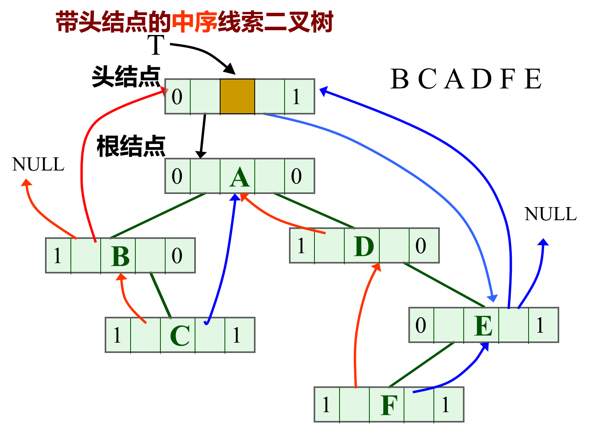

# Alpha 数和二叉树

> 编写于：2024-04-11

## 二叉树的建立

**根据二叉树的中序和后序序列，建立二叉树**

已知一个二叉树的中序序列和后序序列，完成`CreateBitree`函数，实现建立该二叉树的二叉链表存储结构的功能。

**示例输出**

```
A B D E C F G 
```


#### 题目

```c
//已知一个二叉树的中序序列和后序序列，完成CreateBitree函数，实现建立该二叉树的二叉链表存储结构的功能
#include<stdio.h>
#include<stdlib.h>
#include<string.h>

//二叉树的存储表示 
typedef char TElemType;
typedef struct BiTNode{
	TElemType data;
	struct BiTNode *lchild, * rchild;	//左右孩子指针 
}BiTNode, *BiTree;

 
//inorder和postorder是二叉树的中序序列和后序序列
//lowin,highin是中序序列第一和最后结点的下标
//lowpost,highpost 是后序序列第一和最后结点的下标
//返回：二叉树的根结点指针 
BiTree CreateBitree(TElemType inorder[], TElemType postorder[], int lowin, int highin, int lowpost, int highpost)
{
    //请完成此函数代码
	
}


//按前序递归遍历二叉树 
void preorder(BiTree t)
{
	if(t)
	{
		printf("%c ",t->data);
		if(t->lchild)
			preorder(t->lchild);
		if(t->rchild)
			preorder(t->rchild);
	}
}

int main()
{
	TElemType in[]="DBEAFCG";//中序 
	TElemType post[]="DEBFGCA";	//后序 
	BiTree t;
	t = CreateBitree(in, post, 0,strlen(in)-1,0,strlen(post)-1);
	preorder(t);
}
```

#### 答案

> `CreateBitree`函数的参数如下：
>
> 1. `inorder[]`：二叉树的中序序列数组，用于确定节点的相对位置和构建左右子树。
> 2. `postorder[]`：二叉树的后序序列数组，用于确定根节点和构建左右子树。
> 3. `lowin`：中序序列中当前子树的起始索引。
> 4. `highin`：中序序列中当前子树的结束索引。
> 5. `lowpost`：后序序列中当前子树的起始索引。
> 6. `highpost`：后序序列中当前子树的结束索引。
>
> 通过`lowin`和`highin`参数确定当前子树在中序序列中的范围，通过`lowpost`和`highpost`参数确定当前子树在后序序列中的范围。根据这些参数的组合，函数递归地构建二叉树，返回当前子树的根节点指针。
>
> 函数通过后序序列的最后一个元素确定当前子树的根节点，然后在中序序列中找到根节点的位置，进而划分出左子树和右子树的范围。然后递归地构建左子树和右子树，并将它们连接到当前根节点的左孩子和右孩子上。
>
> 最终，函数返回整棵二叉树的根节点指针。

> 还有就是需要添加一个`findIndex()`函数
>
> （我发现我一直对数组里面这些求下标时候的`+1`、`-1`搞不太清楚）

```c
#include<stdio.h>
#include<stdlib.h>
#include<string.h>

//二叉树的存储表示 
typedef char TElemType;

typedef struct BiTNode {
    TElemType data;
    struct BiTNode* lchild, * rchild;	//左右孩子指针 
}BiTNode, * BiTree;


//在中序序列inorder中查找元素value的索引
int findIndex(TElemType inorder[], int low, int high, TElemType value) {
    int i;
    for (i = low; i <= high; i++) {
        if (inorder[i] == value) {
            return i;
        }
    }
    return -1;
}


//根据中序序列和后序序列创建二叉树
BiTree CreateBitree(TElemType inorder[], TElemType postorder[], int lowin, int highin, int lowpost, int highpost)
{
    // 后序序列为空，则返回空二叉树
    if (lowin > highin || lowpost > highpost) {
        return NULL;
    }

    // 后序序列的最后一个元素为当前子树的根节点
    TElemType rootValue = postorder[highpost];

    // 创建根结点
    BiTree root = (BiTree)malloc(sizeof(BiTNode));
    root->data = rootValue;
    root->lchild = NULL;
    root->rchild = NULL;

    // 在中序序列中找到根节点的位置
    int rootIndex = findIndex(inorder, lowin, highin, rootValue);

    // 根据根节点的位置，划分左右子树的范围
    int leftSize = rootIndex - lowin;
    int rightSize = highin - rootIndex;

    // 递归构建左右子树
    root->lchild = CreateBitree(inorder, postorder, lowin, rootIndex - 1, lowpost, lowpost + leftSize - 1);
    root->rchild = CreateBitree(inorder, postorder, rootIndex + 1, highin, highpost - rightSize, highpost - 1);

    return root;
}


//按前序递归遍历二叉树 
void preorder(BiTree t)
{
    if (t)
    {
        printf("%c ", t->data);
        if (t->lchild)
            preorder(t->lchild);
        if (t->rchild)
            preorder(t->rchild);
    }
}


int main()
{
    TElemType in[] = "DBEAFCG"; //中序 
    TElemType post[] = "DEBFGCA"; //后序 
    BiTree t;

    t = CreateBitree(in, post, 0, strlen(in) - 1, 0, strlen(post) - 1);
    // 参数分别为 中序序列，后序序列，中序序列的第一个元素下标，中序序列的最后一个元素下标，后序序列的第一个元素下标，后序序列的最后一个元素下标
    preorder(t);

    return 0;
}
```

> 先比如看下一个题，关于`CreateBitree()`有种更简洁的实现方法，也没有外置`findIndex()`（从第二题的示例代码偷的哈哈哈）
>
> 不过都是一样的，写起来简洁一些而已

```c
BiTree CreateBitree(TElemType inorder[], TElemType postorder[], int lowin, int highin, int lowpost, int highpost)
{
	BiTree bt = (BiTree)malloc(sizeof(BiTNode));// 申请结点
	bt->data = postorder[highpost];// 后序遍历的最后一个结点是根结点

	int i = lowin;
	while (inorder[i] != postorder[highpost]) { // 在中序序列中查找根结点
		i++;
	}
	if (i == lowin) {
		bt->lchild = NULL;  // 处理左子树
	}
	else {
		bt->lchild = CreateBitree(inorder, postorder, lowin, i - 1, lowpost, lowpost + i - lowin - 1);
	}
	
	if (i == highin) {
		bt->rchild = NULL;  // 处理右子树
	}
	else {
		bt->rchild = CreateBitree(inorder, postorder, i + 1, highin, lowpost + i - lowin, highpost - 1);
	}

	return bt;
}
```


## 二叉树的叶子结点

已知一个二叉树的中序序列和后序序列，请完成`CalLeafNum`函数，返回二叉树叶子结点的个数。


#### 题目

```c
//求二叉树中叶子节点的个数

#include<stdio.h>
#include<stdlib.h>
#include<string.h>

//二叉树的存储表示 
typedef char TElemType;
typedef struct BiTNode{
	TElemType data;
	struct BiTNode *lchild, * rchild;	//左右孩子指针 
}BiTNode, *BiTree;


//计算叶结点的个数 
//返回：叶结点的个数 
int CalLeafNum(BiTree t) {
	//请在此填写代码 

}

BiTree CreateBitree(TElemType inorder[], TElemType postorder[], int lowin, int highin, int lowpost, int highpost)
{
	BiTree bt=(BiTree)malloc(sizeof(BiTNode));//申请结点
	bt->data=postorder[highpost];//后序遍历的最后一个结点是根结点
	int i = lowin;
	while(inorder[i]!=postorder[highpost]) //在中序序列中查找根结点
	   i++;
	if(i==lowin)
		bt->lchild=NULL;  //处理左子树
	else
		bt->lchild=CreateBitree(inorder,postorder,lowin,i-1,lowpost,lowpost+i-lowin-1);
	if(i==highin)
		bt->rchild=NULL;  //处理右子树
	else
		bt->rchild=CreateBitree(inorder,postorder,i+1,highin,lowpost+i-lowin,highpost-1);
	return bt;
}

int main()
{
	TElemType in[]="FDGBAHEC";//中序 
	TElemType post[]="FGDBHECA";	//后序 
	BiTree t;
	t = CreateBitree(in, post, 0,strlen(in)-1,0,strlen(post)-1);
	printf("%d",CalLeafNum(t));
}
```

#### 答案

> 在给定的中序序列和后序序列构建二叉树后，通过调用`CalLeafNum`函数计算二叉树的叶子节点个数，并将结果打印出来。
>
> 可以看看这个题示例的`CreateBitree()`函数。

> 都是递归，多多少少还是有点难理解的，起码对于我是如此。

```c
#include<stdio.h>
#include<stdlib.h>
#include<string.h>

//二叉树的存储表示 
typedef char TElemType;

typedef struct BiTNode {
	TElemType data;
	struct BiTNode* lchild, * rchild;	//左右孩子指针 
}BiTNode, * BiTree;


//计算叶结点的个数 
int CalLeafNum(BiTree t) {

	// 如果是空树
	if (t == NULL) {
		return 0;
	}

	// 如果是叶子节点
	if (t->lchild == NULL && t->rchild == NULL) {
		return 1; // 叶子节点
	}

	int leftCount = CalLeafNum(t->lchild); // 左子树叶子节点个数
	int rightCount = CalLeafNum(t->rchild); // 右子树叶子节点个数

	return leftCount + rightCount;
}

// 这样写也可以
//int CalLeafNum(BiTree T) {
//    //计算二叉树的叶子节点个数
//    if (T == NULL) {
//        return 0;
//    }
//    else if (T->lchild == NULL && T->rchild == NULL) {
//        return 1;
//    }
//    else {
//        return CalLeafNum(T->lchild) + CalLeafNum(T->rchild);
//    }
//}


BiTree CreateBitree(TElemType inorder[], TElemType postorder[], int lowin, int highin, int lowpost, int highpost)
{
	BiTree bt = (BiTree)malloc(sizeof(BiTNode));// 申请结点
	bt->data = postorder[highpost];// 后序遍历的最后一个结点是根结点

	int i = lowin; // 定位根结点在中序序列中的位置，一定初始化为lowin
	while (inorder[i] != postorder[highpost]) { // 在中序序列中查找根结点
		i++;
	}

	// 递归构造左右子树
	if (i == lowin) {
		bt->lchild = NULL;  // 处理左子树
	}
	else {
		bt->lchild = CreateBitree(inorder, postorder, lowin, i - 1, lowpost, lowpost + i - lowin - 1);
	}

	if (i == highin) {
		bt->rchild = NULL;  // 处理右子树
	}
	else {
		bt->rchild = CreateBitree(inorder, postorder, i + 1, highin, lowpost + i - lowin, highpost - 1);
	}

	return bt;
}


int main()
{
	TElemType in[] = "FDGBAHEC";//中序 
	TElemType post[] = "FGDBHECA";	//后序 
	BiTree t;

	t = CreateBitree(in, post, 0, strlen(in) - 1, 0, strlen(post) - 1);
	printf("%d", CalLeafNum(t));

	return 0;
}
```

> 这个题用的是“计算叶结点的个数”，这里再附上一个“计算二叉树的节点个数”的算法：
>
> ```c
> int Count_Nodes(Bitree T) {
>     //计算二叉树的节点个数
>     if (T == NULL) {
>         return 0;
>     }
>     else {
>         return 1 + Count_Nodes(T->lchild) + Count_Nodes(T->rchild);
>     }
> }
> ```


## 两棵二叉树是否相同

请编写一个程序，完成`sametree`函数，实现判断两棵二叉树是否是相同树的功能。每棵二叉树的结点包含字符数据，采用中序遍历和后序遍历的方式输入。如果两个二叉树相同时，返回1；不同时，则返回0。

**示例输出**

```
1
```


#### 题目

```c
//判断两棵二叉树是否相同
#include<stdio.h>
#include<stdlib.h>
#include <string.h>

//二叉树的存储表示 
typedef char TElemType;
typedef struct BiTNode{
	TElemType data;
	struct BiTNode *lchild, * rchild;	//左右孩子指针 
}BiTNode, *BiTree;

//请完成该函数，实现判断两棵二叉树是否是相同的树的功能 
//相同，返回1；不同，则返回0 
int sametree(BiTree t1, BiTree t2) {
    //在此输入代码
	
}

BiTree CreateBitree(TElemType inorder[], TElemType postorder[], int lowin, int highin, int lowpost, int highpost)
{
    int i = lowin;
	BiTree bt=(BiTree)malloc(sizeof(BiTNode));//申请结点
	bt->data=postorder[highpost];//后序遍历的最后一个结点是根结点
	
	while(inorder[i]!=postorder[highpost]) //在中序序列中查找根结点
	   i++;
	if(i==lowin)
		bt->lchild=NULL;  //处理左子树
	else
		bt->lchild=CreateBitree(inorder,postorder,lowin,i-1,lowpost,lowpost+i-lowin-1);
	if(i==highin)
		bt->rchild=NULL;  //处理右子树
	else
		bt->rchild=CreateBitree(inorder,postorder,i+1,highin,lowpost+i-lowin,highpost-1);
	return bt;
}

int main()
{
    BiTree t1;
    BiTree t2;
	TElemType in[]="DBEAFCG";//中序 
	TElemType post[]="DEBFGCA";	//后序 
	t1 = CreateBitree(in, post, 0,strlen(in)-1,0,strlen(post)-1);//建立第一个二叉树
	TElemType in2[]="DBEAFCG";//中序 
	TElemType post2[]="DEBFGCA";	//后序 
	t2 = CreateBitree(in2, post2, 0,strlen(in2)-1,0,strlen(post2)-1);//建立第二个二叉树
	printf("%d",sametree(t1,t2));
}
```

#### 答案

> 只看`sametree()`就行，别的都一样。
>
> 还是递归，全是递归。毕竟二叉树就是这么个思想。

```c
#include<stdio.h>
#include<stdlib.h>
#include<string.h>

//二叉树的存储表示 
typedef char TElemType;

typedef struct BiTNode {
	TElemType data;
	struct BiTNode* lchild, * rchild;	//左右孩子指针 
}BiTNode, * BiTree;


//判断两棵二叉树是否相同
int sametree(BiTree t1, BiTree t2) {
	if (t1 == NULL && t2 == NULL) {
		return 1; //两棵树都为空，认为它们相同
	}
	else if (t1 == NULL || t2 == NULL) {
		return 0; // 两棵树中有一棵为空，认为它们不相同
	}
	else if (t1->data != t2->data) {
		return 0; // 根节点的值不相同，认为两棵树不相同
	}

	// 一定要看清楚上面的这三个条件判断。
	// 一定要先判断根节点，再判断左右子树，否则会死循环

	int leftSame = sametree(t1->lchild, t2->lchild); // 判断左子树是否相同
	int rightSame = sametree(t1->rchild, t2->rchild); // 判断右子树是否相同

	return leftSame && rightSame; // 当左子树和右子树都相同时，认为两棵树相同
    // 因为是 leftSame && rightSame; 所以过程中只要有一个是0就会一直是0
}


BiTree CreateBitree(TElemType inorder[], TElemType postorder[], int lowin, int highin, int lowpost, int highpost)
{
	BiTree bt = (BiTree)malloc(sizeof(BiTNode));// 申请结点
	bt->data = postorder[highpost];// 后序遍历的最后一个结点是根结点

	int i = lowin; // 定位根结点在中序序列中的位置，一定初始化为lowin
	while (inorder[i] != postorder[highpost]) { // 在中序序列中查找根结点
		i++;
	}

	// 递归构造左右子树
	if (i == lowin) {
		bt->lchild = NULL;  // 处理左子树
	}
	else {
		bt->lchild = CreateBitree(inorder, postorder, lowin, i - 1, lowpost, lowpost + i - lowin - 1);
	}

	if (i == highin) {
		bt->rchild = NULL;  // 处理右子树
	}
	else {
		bt->rchild = CreateBitree(inorder, postorder, i + 1, highin, lowpost + i - lowin, highpost - 1);
	}

	return bt;
}


int main()
{
	BiTree t1;
	BiTree t2;

	TElemType in[] = "DBEAFCG";//中序 
	TElemType post[] = "DEBFGCA";	//后序 
	t1 = CreateBitree(in, post, 0, strlen(in) - 1, 0, strlen(post) - 1);//建立第一个二叉树

	TElemType in2[] = "DBEAFCG";//中序 
	TElemType post2[] = "DEBFGCA";	//后序 
	t2 = CreateBitree(in2, post2, 0, strlen(in2) - 1, 0, strlen(post2) - 1);//建立第二个二叉树

	printf("%d", sametree(t1, t2));

	return 0;
}
```

> 其实把下面这段代码删除，也能通过检查：
>
> ```c
> else if (t1->data != t2->data) {
> 	return 0; // 根节点的值不相同，认为两棵树不相同
> }
> ```
> 我很不理解。看看这个题的标题“两棵二叉树是否相同”以及下一个题的标题“判别两棵二叉树是否相等”，难道它只要求结构相同，没有要求数据也相同？？


## 判别两棵二叉树是否相等

请编写一个程序，实现判断两棵二叉树是否相同的功能。每棵二叉树采用先序遍历的方式输入，其中用’#'表示空结点。

### 示例

**输入**

```
请以先序遍历的的方式输入第一棵树（#表示结点没有子树）：a##

请以先序遍历的的方式输入第二棵树（#表示结点没有子树）：a##
```

**输出**

```
YES
```


#### 题目

```c
#include <stdio.h>
#include <stdlib.h>

typedef struct BiTNode {
    char data;
    struct BiTNode *lchild, *rchild;
} BiTNode, *Bitree;

void Creat_Bitree(Bitree *T) {
    //请在此处编写代码
    
    
}

int Judge_Same_Tree(Bitree T1, Bitree T2) {
    //请在此处编写代码
    
    
}

int main() {
    Bitree T1, T2;
    printf("请以先序遍历的方式输入第一棵树（#表示结点没有子树）：");
    Creat_Bitree(&T1);
    getchar();
    printf("\n请以先序遍历的方式输入第二棵树（#表示结点没有子树）：");
    Creat_Bitree(&T2);
    getchar();
    printf("\n");
    if (!Judge_Same_Tree(T1, T2))
        printf("NO");
    else
        printf("YES");

    return 0;
}
```

#### 答案

> `Judge_Same_Tree()`函数和上面的一样，不过也有区别，就是这次确实会检查数值是否相同，所以像上一道题那样把`else if (t1->data != t2->data) {return 0;}`这部分删除后并不行。
>
> 所以主要就是`Creat_Bitree()`函数。
>
> 二重指针，注意递归时`Creat_Bitree(&((*T)->lchild));`、`Creat_Bitree(&((*T)->rchild));`的传参。

> 说一下`main()`函数中的两个`getchar();`：
>
> 在主函数中的两个`getchar()`函数调用的作用是用于消耗输入缓冲区中的换行符。这是因为在用户输入完第一棵树的先序遍历序列后按下回车键，输入缓冲区中会包含一个换行符。如果不消耗这个换行符，下一个输入操作就会直接读取到换行符，导致第二棵树的输入被跳过。通过调用两次`getchar()`函数，可以消耗掉输入缓冲区中的换行符，确保接下来的输入操作正常进行。
>
> 其实也就是第一个`getchar();`有用，第二个可有可无。

```c
#include <stdio.h>
#include <stdlib.h>

typedef struct BiTNode {
    char data;
    struct BiTNode* lchild, * rchild;
} BiTNode, * Bitree;


void Creat_Bitree(Bitree* T) {
    char ch;
    scanf("%c", &ch);

    if (ch == '#') {
        *T = NULL;
    }

    else {
        *T = (Bitree)malloc(sizeof(BiTNode));
        (*T)->data = ch;
        Creat_Bitree(&((*T)->lchild));
        Creat_Bitree(&((*T)->rchild));
    }
}


int Judge_Same_Tree(Bitree T1, Bitree T2) {
    if (T1 == NULL && T2 == NULL) {
        return 1; // 两棵树都为空，认为它们相等
    }
    else if (T1 == NULL || T2 == NULL) {
        return 0; // 两棵树中有一棵为空，认为它们不相等
    }
    else if (T1->data != T2->data) {
        return 0; // 根节点的值不相等，认为两棵树不相等
    }

    int leftSame = Judge_Same_Tree(T1->lchild, T2->lchild); // 判断左子树是否相等
    int rightSame = Judge_Same_Tree(T1->rchild, T2->rchild); // 判断右子树是否相等

    return leftSame && rightSame; // 当左子树和右子树都相等时，认为两棵树相等
    // 因为是 leftSame && rightSame; 所以过程中只要有一个是0就会一直是0
}


int main() {
    Bitree T1, T2;

    printf("请以先序遍历的方式输入第一棵树（#表示结点没有子树）：");
    Creat_Bitree(&T1);
    getchar();

    printf("\n请以先序遍历的方式输入第二棵树（#表示结点没有子树）：");
    Creat_Bitree(&T2);
    getchar();

    printf("\n");
    if (!Judge_Same_Tree(T1, T2)) {
        printf("NO");
    }
    else {
        printf("YES");
    }

    return 0;
}
```

> **核心代码：**
>
> ```c
> void Creat_Bitree(Bitree* T) {
>     char ch;
>     scanf("%c", &ch);
> 
>     if (ch == '#') {
>         *T = NULL;
>     }
> 
>     else {
>         *T = (Bitree)malloc(sizeof(BiTNode));
>         (*T)->data = ch;
>         Creat_Bitree(&((*T)->lchild));
>         Creat_Bitree(&((*T)->rchild));
>     }
> }
> ```


## 求二叉树的深度

请完成`GetDepth`函数，实现计算二叉树深度的功能，函数返回二叉树的深度。

**示例输出**

```
3
```


#### 题目

```c
//求二叉树的深度
#include<stdio.h>
#include<stdlib.h>
#include<string.h>

//二叉树的存储表示 
typedef char TElemType;
typedef struct BiTNode{
	TElemType data;
	struct BiTNode *lchild, * rchild;	//左右孩子指针 
}BiTNode, *BiTree;

//计算二叉树的深度
//返回值：二叉树的深度 
int GetDepth(BiTree t) {
	//请在此处完成代码 

}

BiTree CreateBitree(TElemType inorder[], TElemType postorder[], int lowin, int highin, int lowpost, int highpost)
{
	BiTree bt=(BiTree)malloc(sizeof(BiTNode));//申请结点
	bt->data=postorder[highpost];//后序遍历的最后一个结点是根结点
	int i = lowin;
	while(inorder[i]!=postorder[highpost]) //在中序序列中查找根结点
	{
	   i++;
	}
	if(i==lowin)
		bt->lchild=NULL;  //处理左子树
	else
		bt->lchild=CreateBitree(inorder,postorder,lowin,i-1,lowpost,lowpost+i-lowin-1);
	if(i==highin)
		bt->rchild=NULL;  //处理右子树
	else
		bt->rchild=CreateBitree(inorder,postorder,i+1,highin,lowpost+i-lowin,highpost-1);
	return bt;
}

int main()
{
	TElemType in[]="DBEAFCG";//中序 
	TElemType post[]="DEBFGCA";	//后序 
	BiTree t;
	t = CreateBitree(in, post, 0,strlen(in)-1,0,strlen(post)-1);
	printf("%d",GetDepth(t));
}
```

#### 答案

```c
#include <stdio.h>
#include <stdlib.h>
#include <string.h>

// 二叉树的存储表示
typedef char TElemType;

typedef struct BiTNode {
    TElemType data;
    struct BiTNode* lchild, * rchild;  // 左右孩子指针
} BiTNode, * BiTree;

// 计算二叉树的深度
// 返回值：二叉树的深度
int GetDepth(BiTree t) {
    if (t == NULL) {
        return 0;
    }
    else {
        int leftDepth = GetDepth(t->lchild);
        int rightDepth = GetDepth(t->rchild);
        return (leftDepth > rightDepth) ? (leftDepth + 1) : (rightDepth + 1);
    }
}

BiTree CreateBitree(TElemType inorder[], TElemType postorder[], int lowin, int highin, int lowpost, int highpost) {
    BiTree bt = (BiTree)malloc(sizeof(BiTNode));  // 申请结点
    bt->data = postorder[highpost];  // 后序遍历的最后一个结点是根结点

    int i = lowin;
    while (inorder[i] != postorder[highpost]) {  // 在中序序列中查找根结点
        i++;
    }

    if (i == lowin) {
        bt->lchild = NULL;  // 处理左子树
    }
    else {
        bt->lchild = CreateBitree(inorder, postorder, lowin, i - 1, lowpost, lowpost + i - lowin - 1);  // 递归创建左子树
    }

    if (i == highin) {
        bt->rchild = NULL;  // 处理右子树
    }
    else {
        bt->rchild = CreateBitree(inorder, postorder, i + 1, highin, lowpost + i - lowin, highpost - 1);  // 递归创建右子树
    }

    return bt;
}

int main() {
    TElemType in[] = "DBEAFCG";  // 中序
    TElemType post[] = "DEBFGCA";  // 后序

    BiTree t;
    t = CreateBitree(in, post, 0, strlen(in) - 1, 0, strlen(post) - 1);

    int depth = GetDepth(t);
    printf("%d\n", depth);

    return 0;
}
```

> **核心代码：**
>
> ```c
> int GetDepth(BiTree t) {
>     if (t == NULL) {
>         return 0;
>     }
>     else {
>         int leftDepth = GetDepth(t->lchild);
>         int rightDepth = GetDepth(t->rchild);
>         return (leftDepth > rightDepth) ? (leftDepth + 1) : (rightDepth + 1);
>     }
> }
> ```


## 线索二叉树（中序遍历）

请编写一个程序，实现对中序线索二叉树的中序扫描。每个结点包含字符数据和指向左右子树的指针，以及左右线索标记。左线索标记 LTag 为 0 表示指向左子树，为 1 表示指向中序遍历的前驱结点。右线索标记 RTag 为 0 表示指向右子树，为 1 表示指向中序遍历的后继结点。

**示例输出**

```
H D I B J E A F C G 
```


#### 题目

```c
//已知一中序线索二叉树,写一算法完成对它的中序扫描
#include<stdio.h>
#include<stdlib.h>
#include<string.h>

//二叉树的二叉线索存储表示 
typedef enum {Link, Thread} PointerTag; //Link==0:指针，Thread==1：线索 
typedef char TElemType;
typedef struct BiThrNode{
	TElemType data;
	struct BiThrNode *lchild, * rchild;	//左右孩子指针 
	PointerTag LTag,RTag; 
}BiThrNode, *BiThrTree;

void visit(BiThrTree t)
{
	printf("%c ",t->data);
}
//t是指向中序全线索化头结点的指针，该算法实现对线索二叉树中序遍历
void InOrderThreat(BiThrTree t){
	BiThrTree p=t->lchild;  //p指向二叉树的根结点，当二叉树为空时，p指向t
    //请在此完成代码

}

//创建树
BiThrTree CreateTree(){
    //定义结构体对象
    BiThrTree head = NULL,t1 = NULL, t2 = NULL, t3 = NULL, t4 = NULL, t5 = NULL, t6 = NULL, t7 = NULL, t8 = NULL, t9 = NULL, t10 = NULL;
    head = (BiThrTree)malloc(sizeof(BiThrNode));
    memset(head, 0, sizeof(BiThrNode));
	t1 = (BiThrTree)malloc(sizeof(BiThrNode));
    memset(t1, 0, sizeof(BiThrNode));
    t2 = (BiThrTree)malloc(sizeof(BiThrNode));
    memset(t2, 0, sizeof(BiThrNode));
    t3 = (BiThrTree)malloc(sizeof(BiThrNode));
    memset(t3, 0, sizeof(BiThrNode));
    t4 = (BiThrTree)malloc(sizeof(BiThrNode));
    memset(t4, 0, sizeof(BiThrNode));
    t5 = (BiThrTree)malloc(sizeof(BiThrNode));
    memset(t5, 0, sizeof(BiThrNode));
    t6 = (BiThrTree)malloc(sizeof(BiThrNode));
    memset(t6, 0, sizeof(BiThrNode));
    t7 = (BiThrTree)malloc(sizeof(BiThrNode));
    memset(t7, 0, sizeof(BiThrNode));
    t8 = (BiThrTree)malloc(sizeof(BiThrNode));
    memset(t8, 0, sizeof(BiThrNode));
    t9 = (BiThrTree)malloc(sizeof(BiThrNode));
    memset(t9, 0, sizeof(BiThrNode));
    t10 = (BiThrTree)malloc(sizeof(BiThrNode));
    memset(t10, 0, sizeof(BiThrNode));
    t1->data = 'A';
    t2->data = 'B';
    t3->data = 'C';
    t4->data = 'D';
    t5->data = 'E';
    t6->data = 'F';
    t7->data = 'G';
    t8->data = 'H';
    t9->data = 'I';
    t10->data = 'J';

    head->lchild = t1;
    head->rchild = t7;
    head->LTag = Link;
    head->RTag = Thread;
    
    t1->lchild = t2;
    t1->rchild = t3;
    t1->LTag = 0;
    t1->RTag = 0;

    t2->lchild = t4;
    t2->rchild = t5;
	t2->LTag = 0;
    t2->RTag = 0;
    
    t3->lchild = t6;
    t3->rchild = t7;
	t3->LTag = 0;
    t3->RTag = 0;
    
    t4->lchild = t8;
    t4->rchild = t9;
	t4->LTag = 0;
    t4->RTag = 0;
    
    t5->lchild = t10;
    t5->rchild = t1;
	t5->LTag = 0;
    t5->RTag = 1;
    
    t6->lchild = t1;
    t6->rchild = t3;
    t6->LTag = 1;
    t6->RTag = 1;

    t7->lchild = t3;
    t7->rchild = head;
    t7->LTag = 1;
    t7->RTag = 1;

    t8->lchild = head;
    t8->rchild = t4;
    t8->LTag = 1;
    t8->RTag = 1;

    t9->lchild = t4;
    t9->rchild = t2;
    t9->LTag = 1;
    t9->RTag = 1;

	t10->lchild = t2;
    t10->rchild = t5;
    t10->LTag = 1;
    t10->RTag = 1;
    return head;
}

int main()
{
	BiThrTree t;
	t = CreateTree();
	InOrderThreat(t);
	return 0;
}

```

#### 答案

> 题目用到了`memset()`函数，不用多管。
>
> 还有就是枚举：`enum`……发现自己都快忘记这么个东西了。
>
> 其实这个东西是 PPT 上的，但是老师当时候说不讲这个，考试也不会考，呃……

> 
>
> ### **中序**线索二叉树的遍历算法（有头节点）
>
> ① **结束的条件**? 
>
> ​	树空或者指针指向头结点
>
> ② **中序遍历的第一个结点** ？
>
> ​	左子树上处于“最左下”（没有左子树）的结点
>
> ③ **在中序线索二叉树中结点的后继** ？
>
> ​	若无右子树，则右线索所指结点为后继。否则，右子树的“最左下”孩子为后继；

```c
// t是指向中序全线索化头结点的指针，该算法实现对线索二叉树中序遍历
void InOrderThreat(BiThrTree t) {
    BiThrTree p = t->lchild; // p指向二叉树的根结点，如果二叉树为空，则指向t。

    while (p != t) { // 通过while循环遍历整棵树，直到回到头结点。
        // 找到中序遍历的起始结点（最左下结点）
        while (p->LTag == Link) {
            p = p->lchild;
        }

        // 访问当前结点
        visit(p);

        // 如果当前结点的右子树是线索，则沿着线索继续遍历
        while (p->RTag == Thread && p->rchild != t) {
            p = p->rchild;
            visit(p);
        }

        // 转向右子树
        p = p->rchild;
    }
}
```

> 这段代码实现了对中序线索二叉树的遍历，具体的思路和实现如下：
>
> 1. 首先，定义了一个函数 `InOrderThreat`，接受一个指向中序全线索化头结点的指针 `t` 作为参数，该头结点中的 `lchild` 指向树的根节点，`rchild` 指向中序遍历的最后一个节点，`LTag` 和 `RTag` 分别表示左右孩子的类型（是线索还是指针）。
>
> 2. 在函数内部，首先定义一个指针 `p` 指向根结点，如果树为空，则 `p` 指向头结点 `t`。
>
> 3. 通过一个 `while` 循环来遍历整棵树，循环的终止条件是当 `p` 回到头结点 `t` 时。
>
> 4. 内部的第一个 `while` 循环用于找到中序遍历的起始结点，即最左下的结点。这是通过不断向左子树遍历实现的，直到 `p` 的 `LTag` 变为 `Thread` 为止，说明已经到达了最左下的结点。
>
> 5. 访问当前结点 `p`，这里假设有一个函数 `visit`，用于处理遍历到的结点。
>
> 6. 接下来，如果当前结点的右子树是线索（即 `RTag` 为 `Thread`），则通过沿着右孩子的线索继续遍历。这是通过一个内部的 `while` 循环来实现的，直到 `p` 的右孩子不是线索或者指向头结点 `t` 为止。
>
> 7. 最后，将指针 `p` 转向当前结点的右子树，继续遍历。如果右子树是线索，则会直接跳到下一个中序遍历的结点；如果右子树是指针，则会沿着指针向右移动。
>
> 总的来说，这段代码通过利用中序线索二叉树的线索信息，实现了中序遍历。通过 `LTag` 和 `RTag` 标记左右孩子的类型，可以方便地确定遍历的下一个结点。


## 求二叉树的最大宽度

请编写一个程序，实现计算一棵二叉树的最大宽度的功能。每棵二叉树采用先序遍历的方式输入，其中用’#'表示空结点。二叉树的最大宽度是指二叉树所有层中结点个数的最大值。

### 示例

**输入**

```
请以先序遍历的的方式输入第一棵树（#表示结点没有子树）：a##
```

**输出**

```
该二叉树的最大宽度是：1
```


#### 题目

```C
#include<stdio.h>
#include<stdlib.h>
#define MAX 100 //定义队列的最大容量

typedef struct BiTNode {
    //定义结构体
    char data;
    struct BiTNode *lchild, *rchild;
} BiTNode, *Bitree;

void Creat_Bitree(Bitree *T) {
    //以先序遍历的方式创建二叉树
    //请在此处编写代码
    
    
}

int Account_Width(Bitree T) {
    //求二叉树最大宽度
    //请在此处编写代码
    
    
}

int main() {
    Bitree T = NULL;
    printf("请以先序遍历的方式输入第一棵树（#表示结点没有子树）：");
    Creat_Bitree(&T);
    printf("\n");
    printf("该二叉树的最大宽度是：%d", Account_Width(T));
    return 0;
}
```

#### 答案

> 用到了两个辅助函数，一个求高度`GetHeight()`，一个求指定层级的宽度`GetWidth()`，其中`GetHeight()`就是上面题目“求二叉树的深度”。
>
> 多理解理解`GetWidth()`，也挺有意思的。

```C
#include<stdio.h>
#include<stdlib.h>
#define MAX 100 //定义队列的最大容量

typedef struct BiTNode {
    //定义结构体
    char data;
    struct BiTNode* lchild, * rchild;
} BiTNode, * Bitree;


void Creat_Bitree(Bitree* T) {
    //以先序遍历的方式创建二叉树
    char ch;
    scanf("%c", &ch);
    if (ch == '#') {
        *T = NULL;
    }
    else {
        *T = (Bitree)malloc(sizeof(BiTNode));
        (*T)->data = ch;
        Creat_Bitree(&(*T)->lchild);
        Creat_Bitree(&(*T)->rchild);
    }
}


int GetHeight(Bitree T) {
    //求二叉树的高度
    if (T == NULL) {
        return 0;
    }
    int left_height = GetHeight(T->lchild);
    int right_height = GetHeight(T->rchild);
    return left_height > right_height ? (left_height + 1) : (right_height + 1);
}

int GetWidth(Bitree T, int level, int* count) {
    //求二叉树在指定层级的宽度
    if (T == NULL) {
        return 0;
    }
    if (level == 1) { // 函数判断当前层级是否为目标层级，即level是否为1。
        // 如果是，表示当前节点为目标层级的节点，将计数器count的值加1，表示找到了一个宽度。
        (*count)++;
    }
    else if (level > 1) {
        // 如果当前层级大于1，表示目标层级尚未到达，需要继续向下递归。
        // 函数通过递归调用自身，分别传入左子树和右子树，同时将目标层级减1，并传入计数器的指针。
        // 这样，递归调用会在下一层级继续判断是否为目标层级，直到找到目标层级为止。
        GetWidth(T->lchild, level - 1, count);
        GetWidth(T->rchild, level - 1, count);
    }
}


int Account_Width(Bitree T) {
    //求二叉树最大宽度
    int max_width = 0;
    int count;
    int height = GetHeight(T); // 获取二叉树的高度

    for (int level = 1; level <= height; level++) {
        count = 0;
        GetWidth(T, level, &count);
        if (count > max_width) {
            max_width = count;
        }
    }

    return max_width;
}

int main() {
    Bitree T = NULL;
    printf("请以先序遍历的方式输入第一棵树（#表示结点没有子树）：");
    Creat_Bitree(&T);
    printf("\n");
    printf("该二叉树的最大宽度是：%d", Account_Width(T));
    return 0;
}
```


## 编写二叉树的双序遍历算法

请编写一个程序，实现二叉树的双序遍历功能。每棵二叉树采用先序遍历的方式输入，其中用’#'表示空结点。双序遍历是指对于二叉树的每一个结点来说，先访问这个结点，再按双序遍历它的左子树，然后再一次访问这个结点，接下来按双序遍历它的右子树。

### 示例

**输入**

```
请以先序遍历的的方式输入一棵树（#表示结点没有子树）：ab##c##
```

**输出**

```
双序遍历二叉树的结果为：abac
```


#### 题目

```C
#include<stdio.h>
#include<stdlib.h>

typedef struct BiTNode {
    //定义结构体
    char data;
    struct BiTNode *lchild, *rchild;
} BiTNode, *Bitree;

void Creat_Bitree(Bitree *T) {
    //以先序遍历的方式创建二叉树
    //请在此处编写代码
    
    
}

void DoubleTraverse_Tree(Bitree T) {
    //双序遍历二叉树
    //请在此处编写代码
    
    
}

int main() {
    Bitree T = NULL;
    printf("请以先序遍历的方式输入一棵树（#表示结点没有子树）：");
    Creat_Bitree(&T);
    printf("双序遍历二叉树的结果为：");
    DoubleTraverse_Tree(T);
    return 0;
}

```

#### 答案

> 好难啊……

```c
#include <stdio.h>
#include <stdlib.h>

typedef struct BiTNode {
    // 定义结构体
    char data;
    struct BiTNode* lchild, * rchild;
} BiTNode, * Bitree;

// 创建二叉树
void Creat_Bitree(Bitree* T) {
    char ch;
    scanf("%c", &ch);
    if (ch == '#') {
        *T = NULL;
    }
    else {
        *T = (BiTNode*)malloc(sizeof(BiTNode));
        (*T)->data = ch;
        Creat_Bitree(&((*T)->lchild));
        Creat_Bitree(&((*T)->rchild));
    }
}

// 双序遍历二叉树
void DoubleTraverse_Tree(Bitree T) {
    if (T) {
        printf("%c", T->data); // 先访问根节点
        DoubleTraverse_Tree(T->lchild); // 递归双序遍历左子树

        if (T->lchild) {
            printf("%c", T->data); // 再次访问根节点
        }
        // 其实关键就是这个if，想想没有这个if会怎样

        DoubleTraverse_Tree(T->rchild); // 递归双序遍历右子树
    }
}

int main() {
    Bitree T = NULL;
    printf("请以先序遍历的方式输入一棵树（#表示结点没有子树）：");
    Creat_Bitree(&T);
    printf("双序遍历二叉树的结果为：");
    DoubleTraverse_Tree(T);
    printf("\n");
    return 0;
}
```


## 输出二叉树中从每个叶子结点到根结点的路径

请编写一个程序，实现输出一棵二叉树中每个叶子结点到根结点的路径。每棵二叉树采用先序遍历的方式输入，其中用’#'表示空结点。

### 示例

**要求**

```
1、输出的每条路径换行输出
2、每条路径中的结点用一个空格符分开
```

**输入**

```
请以先序遍历的的方式输入一棵树（#表示结点没有子树）：ab##c##
```

**输出**

```
该二叉树中从每个叶子结点到根结点的路径为：
b a
c a
```


#### 题目

```C
#include <stdio.h>
#include <stdlib.h>

#define MAX 100

typedef struct BiTNode {
    //定义结构体
    char data;
    struct BiTNode *lchild, *rchild;
} BiTNode, *Bitree;

void Creat_Bitree(Bitree *T) {
    //以先序遍历的方式创建二叉树
    //请在此处编写代码
    
    
}

void Node_Route(Bitree T, char *path, int path_length) {
    //二叉树中从每个叶子结点到根结点的路径
    //请在此处编写代码
    
    
}

int main() {
    Bitree T = NULL;
    char path[MAX];
    printf("请以先序遍历的方式输入一棵树（#表示结点没有子树）：");
    Creat_Bitree(&T);
    printf("该二叉树中从每个叶子结点到根结点的路径为：\n");
    Node_Route(T, path, 0);
    return 0;
}
```

#### 答案

> 不是很理解`Node_Route()`这个递归.
>
> 其实想清楚`path_length`值的变化就会好很多。

```C
#include <stdio.h>
#include <stdlib.h>

#define MAX 100

typedef struct BiTNode {
    // 定义结构体
    char data;
    struct BiTNode* lchild, * rchild;
} BiTNode, * Bitree;

void Creat_Bitree(Bitree* T) {
    // 以先序遍历的方式创建二叉树
    char ch;
    scanf("%c", &ch);
    if (ch == '#') {
        *T = NULL;
    }
    else {
        *T = (Bitree)malloc(sizeof(BiTNode));
        (*T)->data = ch;
        Creat_Bitree(&((*T)->lchild));
        Creat_Bitree(&((*T)->rchild));
    }
}

void Node_Route(Bitree T, char* path, int path_length) {
    // 二叉树中从每个叶子结点到根结点的路径
    if (T == NULL) { // 空树
        return;
    }
    
    path[path_length] = T->data; // 将当前节点加入路径
    path_length++;

    if (T->lchild == NULL && T->rchild == NULL) {
        // 叶子节点，输出路径
        for (int i = path_length - 1; i >= 0; i--) {
            printf("%c ", path[i]); // 逆序输出路径
        }
        printf("\n");
    }
    else {
        Node_Route(T->lchild, path, path_length);
        Node_Route(T->rchild, path, path_length);
    }
}

int main() {
    Bitree T = NULL;
    char path[MAX];
    printf("请以先序遍历的方式输入一棵树（#表示结点没有子树）：");
    Creat_Bitree(&T);
    printf("该二叉树中从每个叶子结点到根结点的路径为：\n");
    Node_Route(T, path, 0);
    return 0;
}
```


## 判别二叉树是不是完全二叉树（伪正确）

请编写一个程序，实现判断一棵二叉树是否是完全二叉树的功能。每棵二叉树采用先序遍历的方式输入，其中用’#'表示空结点。

### 示例

**输入**

```
请以先序遍历的的方式输入一棵树（#表示结点没有子树）：ab##c##
```

**输出**

```
YES
```


#### 题目

```C
#include <stdio.h>
#include <stdlib.h>

typedef struct BiTNode {
    //定义结构体
    char data;
    struct BiTNode *lchild, *rchild;
} BiTNode, *Bitree;

void Creat_Bitree(Bitree *T) {
    //以先序遍历的方式创建二叉树
    //请在此处编写代码
    
    
}

int Count_Nodes(Bitree T) {
    //计算二叉树的节点个数
    //请在此处编写代码
    
    
}

int Count_LeafNodes(Bitree T) {
    //计算二叉树的叶子节点个数
    //请在此处编写代码
    
    
}

int Judge_FullBiTree(Bitree T) {
    //判断二叉树是否为完全二叉树
    //请在此处编写代码
    
    
}

int main() {
    Bitree T = NULL;
    printf("请以先序遍历的方式输入一棵树（#表示结点没有子树）：");
    Creat_Bitree(&T);
    if (Judge_FullBiTree(T))
        printf("YES");
    else
        printf("NO");
    return 0;
}

```

#### 答案

> 先看看要求完成的这四个函数：`Creat_Bitree()`老演员了；`Count_LeafNodes()`计算叶子节点个数，请见第二题：“二叉树的叶子节点”；`Count_LeafNodes()`计算二叉树的节点个数其实在第二题最后也提了一下。（其实根本不需要`Count_LeafNodes()`和`Count_LeafNodes()`，整体删除了也能通过检查）
>
> 其实他俩存在的意义是辅助判断二叉树是否为完全二叉树，你看`main()`里面的传参就知道了。

> 所以重点就是`Judge_FullBiTree()`判断二叉树是否为完全二叉树了。
>
> 参考文章（超链接）：[判断是否为完全二叉树(两种方法)](https://blog.csdn.net/yuiop123455/article/details/109542938)

```c
#include <stdio.h>
#include <stdlib.h>

typedef struct BiTNode {
    //定义结构体
    char data;
    struct BiTNode* lchild, * rchild;
} BiTNode, * Bitree;


void Creat_Bitree(Bitree* T) {
    //以先序遍历的方式创建二叉树
    char ch;
    scanf("%c", &ch);

    if (ch == '#') {
        *T = NULL;
    }
    else {
        *T = (Bitree)malloc(sizeof(BiTNode));
        (*T)->data = ch;
        Creat_Bitree(&(*T)->lchild);
        Creat_Bitree(&(*T)->rchild);
    }
}


int Count_Nodes(Bitree T) { // 其实根本不需要这个函数，整体删除了也能通过检查
    //计算二叉树的节点个数
    if (T == NULL) {
        return 0;
    }
    else {
        return 1 + Count_Nodes(T->lchild) + Count_Nodes(T->rchild);
    }
}


int Count_LeafNodes(Bitree T) { // 其实根本不需要这个函数，整体删除了也能通过检查
    //计算二叉树的叶子节点个数
    if (T == NULL) {
        return 0;
    }
    else if (T->lchild == NULL && T->rchild == NULL) {
        return 1;
    }
    else {
        return Count_LeafNodes(T->lchild) + Count_LeafNodes(T->rchild);
    }
}


int Judge_FullBiTree(Bitree T) {
    //判断是否是完全二叉树
    //返回值：1表示是完全二叉树，0表示不是完全二叉树
    if (T == NULL) {
        return 1; // 空树是完全二叉树
    }
    else if (T->lchild == NULL && T->rchild == NULL) { // 叶子节点是完全二叉树
        return 1;
    }
    else if (T->lchild == NULL || T->rchild == NULL) { // 只有一个子树的节点不是完全二叉树
        return 0;
    }
    else {
        return Judge_FullBiTree(T->lchild) && Judge_FullBiTree(T->rchild);
    }
}


int main() {
    Bitree T = NULL;
    printf("请以先序遍历的方式输入一棵树（#表示结点没有子树）：");
    Creat_Bitree(&T);

    int nodeCount = Count_Nodes(T); // 计算二叉树的节点个数
    int leafCount = Count_LeafNodes(T); // 计算二叉树的叶子节点个数

    if (Judge_FullBiTree(T, 1, nodeCount)) {
        printf("YES");
    }
    else {
        printf("NO");
    }

    return 0;
}
```

> 有一说一，这次居然`POE`、`ChatGPT`、`Kimi`加起来都打不过`Fitten Code`，据说`Fitten Code`会一直有免费版本面向个人用户，但愿如此吧。（`Fitten Code`好像是清华的？不过`Kimi`貌似也是清华的。）
>
> 呃……不过这代码其实也不正确，但是能过检查。（伪正确）

### 错误示范 1

```c
int Judge_FullBiTree(Bitree T) {
    if (T == NULL) {
        return 1; // 空树是完全二叉树
    }
    // 如果左子树为空，且右子树不为空，则不是完全二叉树
    if (T->lchild == NULL && T->rchild != NULL) {
        return 0;
    }
    // 如果左子树不为空，递归判断左子树是否为完全二叉树
    if (!Judge_FullBiTree(T->lchild)) {
        return 0;
    }
    // 如果当前节点有右孩子，且右孩子不为空，则继续递归判断右子树
    if (T->rchild != NULL) {
        return Judge_FullBiTree(T->rchild);
    }
    return 1; // 其他情况都是完全二叉树
}
```

> 完全二叉树是指除了最后一层外，其他每一层的节点数都达到最大值，且最后一层的节点依次从左到右排列。但是这段代码存在一些问题：
>
> 1. 对于判断完全二叉树的条件不够完整。完全二叉树的定义还需要考虑最后一层的节点，而当前代码并没有对最后一层节点的排列顺序进行判断。
> 2. 只判断了左子树为空时右子树不为空的情况，但在完全二叉树中，左子树为空时右子树必须全部为空才满足条件。
> 3. 不完整的条件导致可能错误地将非完全二叉树识别为完全二叉树。


### 伪正确代码

> 下面这个能过检查，但是我认为这并不正确，比如最后一层某些节点只有左子树而没有右子树，也是完全二叉树呀，这时候`else if (T->lchild == NULL || T->rchild == NULL)`就不正确了。
>
> 但是他确实能通过检查……

```c
int Judge_FullBiTree(Bitree T) {
    //判断是否是完全二叉树
    //返回值：1表示是完全二叉树，0表示不是完全二叉树
    if (T == NULL) {
        return 1; // 空树是完全二叉树
    }
    else if (T->lchild == NULL && T->rchild == NULL) { // 叶子节点是完全二叉树
        return 1;
    }
    else if (T->lchild == NULL || T->rchild == NULL) { // 只有一个子树的节点不是完全二叉树
        return 0;
    }
    else {
        return Judge_FullBiTree(T->lchild) && Judge_FullBiTree(T->rchild);
    }
}
```

> 修改如下，可是这又通不过检查了……很无语。

```c
int Count_Height(Bitree T) {
    // 计算二叉树的高度
    if (T == NULL) {
        return 0;
    }
    else {
        int left_height = Count_Height(T->lchild);
        int right_height = Count_Height(T->rchild);
        return (left_height > right_height) ? (left_height + 1) : (right_height + 1);
    }
}

int Judge_FullBiTree(Bitree T) {
    //判断是否是完全二叉树
    //返回值：1表示是完全二叉树，0表示不是完全二叉树

    if (T == NULL) {
        return 1; // 空树是完全二叉树
    }
    else {
        int result_left = Judge_FullBiTree(T->lchild);
        int result_right = Judge_FullBiTree(T->rchild);

        // 如果左子树和右子树都是完全二叉树，继续判断其他情况
        if (result_left && result_right) {
            int left_height = Count_Height(T->lchild);
            int right_height = Count_Height(T->rchild);

            // 如果左子树是完全二叉树，且右子树是满二叉树且高度相差不超过1，则返回1
            if (result_left && result_right && abs(left_height - right_height) <= 1) {
                return 1;
            }
            // 如果左子树是完全二叉树，且右子树是完全二叉树且高度差为1，则返回1
            else if (result_left && Judge_FullBiTree(T->rchild) && left_height == right_height + 1) {
                return 1;
            }
        }
    }
    // 其他情况均返回0
    return 0;
}
```

