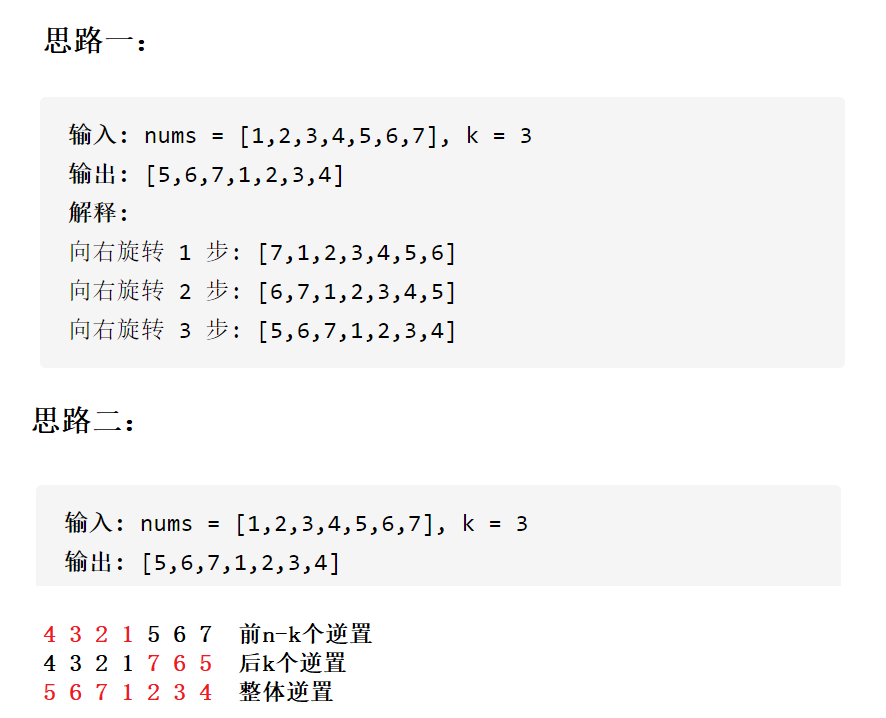

# 复杂度例题


## 时间复杂度例题

### 1

```c
// 计算BubbleSort的时间复杂度？
void BubbleSort(int* a, int n)
{
	assert(a);
	for (int end = n; end > 0; --end)
	{
		int exchange = 0;
		for (int i = 1; i < end; ++i)
		{
			if (a[i - 1] > a[i])
			{
				Swap(&a[i - 1], &a[i]);
				exchange = 1;
			}
		}
		if (exchange == 0)
			break;
	}
}
```

基本操作执行最好N次，最坏执行了(N*(N+1)/2次，通过推导大O阶方法+时间复杂度
一般看最坏，时间复杂度为 O(N^2)


### 2

```c
int main() {
	int i, j, k;
	int n;
	int x;
	for (i = 1; i <= n; i++) {
		for (j = 1; j <= i; j++) {
			for (k = 1; k <= j; k++) {
				x = x + 1;
			}
		}
	}
	printf("\n%d\n", x);
	return 0;
}
```

这段函数的时间复杂度是O(n^3)。

让我们逐步分析：

1. 外层循环：`for (i = 1; i <= n; i++)`，循环次数为n次。

2. 第二层循环：`for (j = 1; j <= i; j++)`，循环次数从1到n不等，平均循环次数约为n/2次。

3. 第三层循环：`for (k = 1; k <= j; k++)`，循环次数从1到i不等，平均循环次数约为i/2次。

因此，总的循环次数可以近似为：

`1 + 2 + 3 + ... + n/2 ≈ (n/2)^2 = n^2/4`

所以，时间复杂度为O(n^2/4) = O(n^2)。

然而，我们还需要考虑内部的赋值操作 `x = x + 1;`。这个操作在最内层循环中执行，而最内层循环的次数等于第二层循环的次数乘以第三层循环的次数，即`(i/2) * (i/2) = i^2/4`。

因此，总的赋值操作次数可以近似为：

`1^2/4 + 2^2/4 + 3^2/4 + ... + n^2/4 ≈ (1/4) * (1^2 + 2^2 + 3^2 + ... + n^2)`

这个求和结果是一个平方和的形式，根据平方和的求和公式，可以得到：

`(1/4) * (1^2 + 2^2 + 3^2 + ... + n^2) = (1/4) * (n * (n+1) * (2n+1)) / 6`

因此，赋值操作的时间复杂度可以近似为O(n^3)。

综合考虑循环次数和赋值操作次数，最终的时间复杂度为O(n^3)。


### 3

```c
int main() {
	int i = 1;
	int n;
	while (i <= n) {
		i = i * 2;
	}
	return 0;
}
```

这段函数的时间复杂度是 O(log n)。

让我们逐步分析：

1. 初始化变量：`int i = 1;` 这是一个常数时间操作，与输入规模 n 无关。

2. 循环条件：`while (i <= n)`，循环会一直执行直到 i 大于 n。

3. 循环体内操作：`i = i * 2;` 这个操作将 i 乘以 2，即使每次循环 i 的值都会翻倍。

根据上述分析，循环体内的操作会导致 i 的值以指数形式增长，即 i 的取值序列为 1, 2, 4, 8, 16, ...，直到 i 大于 n。

因此，循环的迭代次数取决于 i 能够增长到多少才能超过 n。假设最后一次循环时 i 的值为 m，则满足以下条件：

`2^m > n`

> 若循环执行1次：i = 1 x 2 = 2
>
> 若循环执行2次：i = 2 x 2 = 2^2^
>
> 若循环执行3次：i = 2^2^ x 2 = 2^3^
>
> 若循环执行 m 次：i = 2^m^

要求：`i<=m`，即 2^m^ <= n，

即`m >= log2(n)`

因此，迭代次数 m 的上限为 log2(n)。由于每次迭代都会将 i 值翻倍，因此迭代次数 m 的上限也表示 i 的最大值。

综上所述，该函数的时间复杂度为 O(log n)。


### 4

```c
// 计算BinarySearch的时间复杂度？
int BinarySearch(int* a, int n, int x)
{
	assert(a);
	int begin = 0;
	int end = n;
	while (begin < end)
	{
		int mid = begin + ((end - begin) >> 1);
		if (a[mid] < x)
			begin = mid + 1;
		else if (a[mid] > x)
			end = mid;
		else
			return mid;
	}
	return -1;
}
```

基本操作执行最好1次，最坏`O(logN)`次，时间复杂度为 `O(logN)` 

ps：logN在算法分析中表示是底数为2，对数为N。有些地方会写成lgN。（建议通过折纸查找的方式讲解logN是
怎么计算出来的）


### 5

```C
// 计算阶乘递归Factorial的时间复杂度？
long long Factorial(size_t N)
{
	return N < 2 ? N : Factorial(N - 1) * N;
}
```

通过计算分析发现基本操作递归了N次，时间复杂度为O(N)。


## 空间复杂度例题

### 1

```c
// 计算BubbleSort的空间复杂度？
void BubbleSort(int* a, int n)
{
	assert(a);
	for (int end = n; end > 0; --end)
	{
		int exchange = 0;
		for (int i = 1; i < end; ++i)
		{
			if (a[i - 1] > a[i])
			{
				Swap(&a[i - 1], &a[i]);
				exchange = 1;
			}
		}
		if (exchange == 0)
			break;
	}
}
```

**使用了常数个额外空间，所以空间复杂度为 O(1)**


### 2

```c
// 计算Fibonacci的空间复杂度？
long long* Fibonacci(int n)
{
	if (n == 0)
		return;
	long long* fibArray = (long long*)malloc((n + 1) * sizeof(long long));
	fibArray[0] = 0;
	fibArray[1] = 1;
	for (int i = 2; i <= n; ++i)
	{
		fibArray[i] = fibArray[i - 1] + fibArray[i - 2];
	}
	return fibArray;
}
```

**动态开辟了N个空间，空间复杂度为 O(N)**


### 3

```c
// 计算阶乘递归Factorial的空间复杂度？
long long Factorial(int N)
{
	return N < 2 ? N : Factorial(N - 1) * N;
}
```

递归调用了N次，开辟了N个栈帧，每个栈帧使用了常数个空间。空间复杂度为O(N)


### OJ

**旋转数组**

**OJ链接：**https://leetcode-cn.com/problems/rotate-array/



