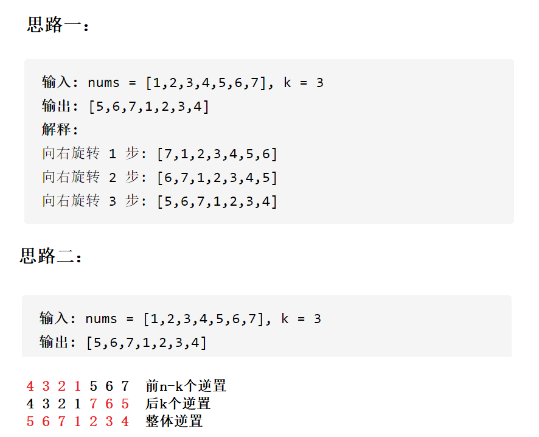

# 空间复杂度例题

## 1

```c
// 计算BubbleSort的空间复杂度？
void BubbleSort(int* a, int n)
{
	assert(a);
	for (int end = n; end > 0; --end)
	{
		int exchange = 0;
		for (int i = 1; i < end; ++i)
		{
			if (a[i - 1] > a[i])
			{
				Swap(&a[i - 1], &a[i]);
				exchange = 1;
			}
		}
		if (exchange == 0)
			break;
	}
}
```

**使用了常数个额外空间，所以空间复杂度为 O(1)**


## 2

```c
// 计算Fibonacci的空间复杂度？
long long* Fibonacci(int n)
{
	if (n == 0)
		return;
	long long* fibArray = (long long*)malloc((n + 1) * sizeof(long long));
	fibArray[0] = 0;
	fibArray[1] = 1;
	for (int i = 2; i <= n; ++i)
	{
		fibArray[i] = fibArray[i - 1] + fibArray[i - 2];
	}
	return fibArray;
}
```

**动态开辟了N个空间，空间复杂度为 O(N)**


## 3

```c
// 计算阶乘递归Factorial的空间复杂度？
long long Factorial(int N)
{
	return N < 2 ? N : Factorial(N - 1) * N;
}
```

递归调用了N次，开辟了N个栈帧，每个栈帧使用了常数个空间。空间复杂度为O(N)


## OJ

**旋转数组**

**OJ链接：**https://leetcode-cn.com/problems/rotate-array/



